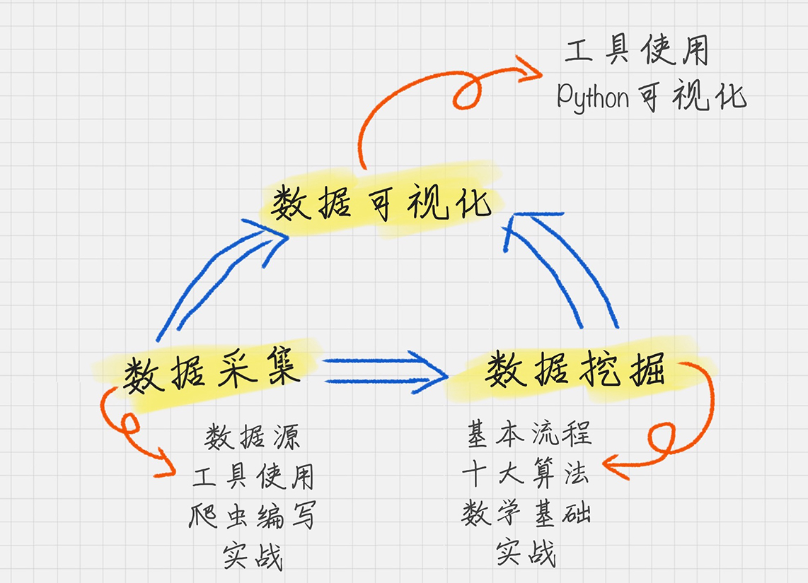
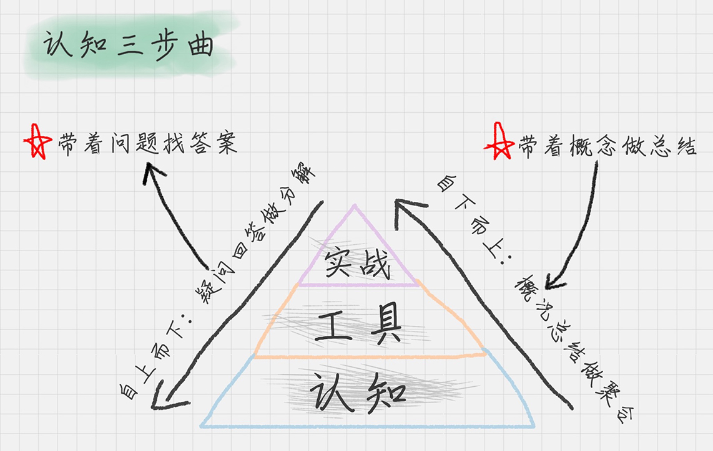

# 数据分析全景图和修炼指南


## 全景图：数据分析的三个重要组成部分

## 1.数据采集

### 1.1 数据源
- 开源数据源
- 爬虫抓取
- 日志采集
- 传感器
### 1.2 工具使用
- 八爪鱼
- 火车采集器
- 搜集客
### 1.3 爬虫编写（Python利器）
- Selenium
- Lxml
- Scrapy
- phantomjs
### 1.4 实战
- 如何自动抓取微博评论
- 如何自动下载明星海报
- 如何自动给微博加粉丝
## 2.数据挖掘

### 2.1 数学基础
- 概率论与数理统计
- 线性代数
- 图论
- 最优方法
### 2.2 基本流程
- 商业理解
- 数据理解
- 数据准备
- 模型建立
- 模型评估
- 上线发布
### 2.3 十大算法
- 分类算法：C4.5, 朴素贝叶斯, SVM, KNN, Adaboost, CART
- 聚类算法：K-Means, EM
- 关联分析：Apriori
- 连接分析：PageRank
### 2.4 实战
- 如何对手写数字进行识别？
- 如何进行乳腺癌检测？
- 如何对文档进行归类？
- ...

## 3.数据可视化

### 3.1 使用Python类库
- Matplotlib
- seaborn
### 3.2 使用第三方工具(已经生成了 csv 格式文件)
- 微图
- DataV
- Data GIF Maker

## 修炼指南
### 1、只有把知识转化成为自己的语言，它才变成了我们自己的东西
### 2、认知三步曲

```markdown
                实战
            工       具
        认               知
```


> 自上而下 疑问回答做分解

带着问题找答案

> 自下而上 概况总结做聚合

带着概念作总结

### 3、牢记原则
- 3.1 不重复造轮子
- 3.2 工具决定效率
- 3.3 熟练度

## 总结

- 1. 记录一下每天的认知
- 2. 这些认知对应的工具的那些操作
- 3. 做更多的联系来巩固你的认知


