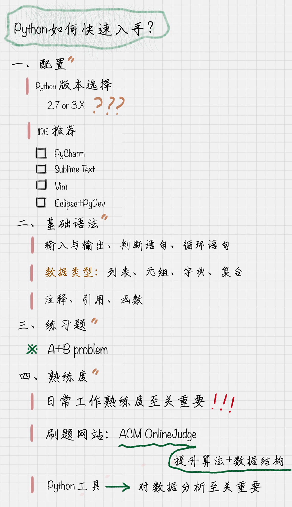

# Python基础语法--总结

## 1 安装以及IDE环境

### 1.1 Python版本的选择
- Python 2.7.x：出现早，2017年调查依然占主流63.7%
- Python 3.x：2008年出现，逐渐取代2.7.x
- 区别：语法区别不到10%，按需选取不同版本


### 1.2 Python IDE 主流推荐
- PyCharm: 跨平台，强
- Sublime Text: 启动反应快，支持到位
- Vim：简洁、搞效、速度快、做任何事
- Eclipse+PyDev：熟悉JAVA Eclipse的人易于快速上手

## 2 Python的基础语法
### 2.1 输入输出
### 2.2 判断语句：if...else...:
- 支持嵌套,使用冒号和缩进规范语法
### 2.3 循环语句1：for...in
- 通常和range()函数结合使用，range(1,11,2)用于增加步长，生成一个列表
### 2.4 循环语句2：while
` 两种循环语句的区别：for...in用于长度固定的时候，while用于长度不固定的时候`
### 2.5 数据类型：列表、元组、字典、集合
#### 列表 [list]：[]
- 结合使用：len(),append(),insert(),pop(),查：直接print()
### 元组(tuple):()
- 不支持修改，append(),insert(),不适用，里面元素类型为list的可以修改，查：直接print()
### 字典{dict}：{}
- 存储键值对：{key, value},结合使用：pop(),查：get()，score.get('yase',99)用于默认赋值,增：直接赋值score['toohoo']=98
### 集合set：s = set(['a','b','c'])
- 类似dict，只是key的集合，不存储value；集合使用：add(),remove(),in关键字用于判断元素是否在集合里面:print 'c' in s
### 2.6 注释
- '''注释内容'''；"""注释内容"""
### 2.7 引用模块/包：import
- 直接引入：import (引入的是.py文件)
- 从文件夹中引入：from...import(文件夹中需要：__init__.py文件)
### 2.8 函数：def
- 例如：
```markdown
def function():
    return args
```
### 2.9 基础进阶：ACM Online Judge
- zoj，poj

## 3 总结
### 开发讲求熟练度：练习，练习，再练习！


## 4 练习题
### 题目一：
scikit-learn(sklearn)不是Python的内置类库，需要使用pip安装先
> import sklearn

导入里面的模块：
> from sklearn import xxx

### 题目二：
代码实现：
```python
# 法一：
oddsum = 0
for number in range(1,101,2):
    oddsum = oddsum + number
print(oddsum)
# 法二：
oddsum = 0
oddsum = 0
number = 1
while number < 101:
    oddsum = oddsum + number
    number += 2
print(oddsum)
# 法三：
print(sum(range(1,101,2)))
# 结果：2500
```


 
 
 
 
 
 
 
 
 

