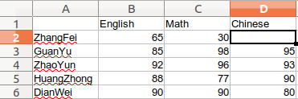

# Python科学计算——Pandas的学习总结

## Pandas的核心数据结构：Series和DataFrame
- 分别代表一维的序列和二维的表结构
- 基于这两种结构：Pandas可以对数据进行导入、清洗、处理、统计和输出
## Series 序列 
- 1.*Series是个固定长度的字典序列*
    - 与字典结构区别：存储的时候相当于两个ndarray，而字典结构里面元素的个数是不确定的。
- 2、*两个基本属性：index和values*
    - index默认是递增的整数序列；0,1,2,3...，也可以是自定义的序列：index=['a','b','c','d']。

> pandas 的Series的使用实例：

```python
import pandas as pd
from pandas import Series, DataFrame
x1 = Series([1,2,3,4]) # 使用默认的方式指定index
x2 = Series(data=[1,2,3,4], index=['a','b','c','d']) # 使用指定的方式指定index
print(x1)
print(x2) # 最后会输出数据类型
'''
# 运行结果：
0    1
1    2
2    3
3    4
dtype: int64
a    1
b    2
c    3
d    4
dtype: int64
'''
# 使用字典的方式创建Series
d = {'a':1, 'b':2, 'c':3, 'd':4}
x3 = Series(d)
print(x3)
'''
运行结果
a    1
b    2
c    3
d    4
dtype: int64
'''
```
## DataFrame 类型数据结构类似于数据库表
- 包含行索引和列索引，DataFrame可看做由相同索引的Series组成的字典类型。
> 例如输出同学的考试成绩

```python
import pandas as pd
from pandas import Series, DataFrame
data = {'Chinese': [66, 95, 93, 90,80],
        'English': [65, 85, 92, 88, 90],
        'Math': [30, 98, 96, 77, 90]}
# 使用默认的索引0,2,3,4...,对应的列索引为Chinese，English，Math
df1= DataFrame(data)
# 指定行索引为index，列索引为columns（里面的科目是可以换位置的）
df2 = DataFrame(data, index=['ZhangFei', 'GuanYu', 'ZhaoYun', 'HuangZhong', 'DianWei'], 
                columns=['English', 'Math', 'Chinese'])
print(df1)
print(df2)
'''
# 运行结果：
   Chinese  English  Math
0       66       65    30
1       95       85    98
2       93       92    96
3       90       88    77
4       80       90    90
            English  Math  Chinese
ZhangFei         65    30       66
GuanYu           85    98       95
ZhaoYun          92    96       93
HuangZhong       88    77       90
DianWei          90    90       80
'''
```
### 数据的导入
- 可以使用Pandas导入导出xlsx，csv文件
```python
import pandas as pd
from pandas import Series, DataFrame
score = DataFrame(pd.read_excel('data.xlsx'))
score.to_excel('data1.xlsx')
print(score)
'''
运行结果：
   Unnamed: 0  English  Math  Chinese
0    ZhangFei       65    30       66
1      GuanYu       85    98       95
2     ZhaoYun       92    96       93
3  HuangZhong       88    77       90
4     DianWei       90    90       80
'''
# 注意：1.需要安装xlrd包和openpy包
#       2.需要使用excel创建xlsx文件，否则会包格式错误
```

### 需要注意的是：
- 使用excel文件导入的数据的index是已经规定好的了:从0,1,2,3...这样的顺序往下。当我们再设置, index=['ZhangFei', 'GuanYu', 'ZhaoYun', 'HuangZhong', 'DianWei']的时候查找出来的都是NaN,因为这样的索引对应的是没有数据的：
```python
import pandas as pd
from pandas import Series, DataFrame
data = DataFrame(pd.read_excel('data.xlsx'))
df1= DataFrame(data)
df2 = DataFrame(data, index=['ZhangFei', 'GuanYu', 'ZhaoYun', 'HuangZhong', 'DianWei'], 
                columns=['English', 'Math', 'Chinese'])
print(df2)
'''
# 执行的结果
            English  Math  Chinese
ZhangFei        NaN   NaN      NaN
GuanYu          NaN   NaN      NaN
ZhaoYun         NaN   NaN      NaN
HuangZhong      NaN   NaN      NaN
DianWei         NaN   NaN      NaN
'''
```
- 当把index去掉之后，或者index=[0,1,2,3,4]，同时加上name列字段时候，就可以正常查询出数据，也就是说excel表格默认的索引是从0开始的整数，不能自定义索引。
```python
import pandas as pd
from pandas import Series, DataFrame
data = DataFrame(pd.read_excel('data.xlsx'))
df1= DataFrame(data)
# index可去掉
df2 = DataFrame(data, index=[0,1,2,3,4],
                columns=['name','English', 'Math', 'Chinese'])
print(df2)
'''
# 运行结果
print(df2)
         name  English  Math  Chinese
0    ZhangFei     65.0  30.0     66.0
1      GuanYu     85.0  98.0     95.0
2     ZhaoYun     92.0  96.0     93.0
3  HuangZhong     88.0  77.0     90.0
4     DianWei     90.0  90.0     80.0
'''
```

### 数据清洗
#### 1.删除DataFrame中的不必要的列或行
- Pandas直接提供drop()函数删除不想要的行和列：
    - 如删除Chinese列和删除ZhangFei这行
```python
import pandas as pd
from pandas import Series, DataFrame
data = {'Chinese': [66, 95, 93, 90,80],
        'English': [65, 85, 92, 88, 90],
        'Math': [30, 98, 96, 77, 90]}
df1= DataFrame(data)
df2 = DataFrame(data, index=['ZhangFei', 'GuanYu', 'ZhaoYun', 'HuangZhong', 'DianWei'], 
                columns=['English', 'Math', 'Chinese'])
df2 = df2.drop(columns=['Chinese']) # 直接调用drop
df2 = df2.drop(index=['ZhangFei'])
print(df1)
print(df2)
'''
# 运行结果：
   Chinese  English  Math
0       66       65    30
1       95       85    98
2       93       92    96
3       90       88    77
4       80       90    90
            English  Math
GuanYu           85    98
ZhaoYun          92    96
HuangZhong       88    77
DianWei          90    90
'''
```

#### 2.重命名columns，使得列表适合需要
- 可以直接使用rename(colimns=new_names, inplace=True)函数
```python
df2.rename(columns={'Chinese':'YuWen', 'English':'Yingyu'}, inplace=True)
```

#### 3.去掉重复的值
- 可以使用：drop_duplicates()会把重复的行去掉
```python
df=df.drop_duplicates()  # 去除重复的行
```
#### 4.格式问题处理
- 在处理不规范的数据格式的问题的时候，使用astype来对数据格式进行更改
```python
import pandas as pd
import numpy as np
from pandas import Series, DataFrame
data = {'Chinese': [66, 95, 93, 90,80],
        'English': [65, 85, 92, 88, 90],
        'Math': [30, 98, 96, 77, 90]}
df1= DataFrame(data)
df2 = DataFrame(data, index=['ZhangFei', 'GuanYu', 'ZhaoYun', 'HuangZhong', 'DianWei'], 
                columns=['English', 'Math', 'Chinese'])
# df2['Chinese'].astype('str')
df2['Chinese'].astype(np.int64)
print(df1)
print(df2)
# 运行的结果显示虽然相同，但是数据格式已经改变
```

#### 数据间的空格和特殊符号的处理
- 首先将chinese数据格式转换成str方便操作，可以直接调用strip()函数进行操作
```python
import pandas as pd
from pandas import Series, DataFrame
data = {'Chinese': [ 66, 95 , 93, 90 , 80],
        'English': [65, 85, 92, 88, 90],
        'Math': [30, 98, 96, 77, 90]}
df1= DataFrame(data)
df2 = DataFrame(data, index=['ZhangFei', 'GuanYu', 'ZhaoYun', 'HuangZhong', 'DianWei'], 
                columns=['English', 'Math', 'Chinese'])
# 先将chinese转换成为str格式
# 删除左右两边的空格、左边空格、右边空格
df2['Chinese']=df2['Chinese'].astype('str').map(str.strip) # 需要写成这个形式
# df2['Chinese']=df2['Chinese'].map(str.lstrip) # 没转换格式报错
# df2['Chinese']=df2['Chinese'].map(str.rstrip)
df2['Chinese']=df2['Chinese'].astype('str').str.strip('$') # 去掉某个特殊的符号
print(df1)
print(df2)
```

####大小写转换
- upper():小变大；lower():大变小；title():首字母大写
```python
import pandas as pd
from pandas import Series, DataFrame
data = {'Chinese': [66, 95 , 93, 90 , 80],
        'English': [65, 85, 92, 88, 90],
        'Math': [30, 98, 96, 77, 90]}
df1= DataFrame(data)
df2 = DataFrame(data, index=['ZhangFei', 'GuanYu', 'ZhaoYun', 'HuangZhong', 'DianWei'], 
                columns=['English', 'Math', 'Chinese'])
# columns变成大写
df2.columns = df2.columns.str.upper()
# columns变成小写
df2.columns = df2.columns.str.lower()
# columns首字母变成大写
df2.columns = df2.columns.str.title()
print(df1)
print(df2)
# 注意：改变大小写的是columns： ENGLISH  MATH  CHINESE，里面的而数据如果送str，是不会变的，变小写同样道理
```

####查找空值
- 使用Pandas中的isnull进行查找，直接调用df2.isnull()函数进行NaN空值判断，空就返回True，否则返回False
- 判断那列存在空值，使用df2.isnull.any()来判断
- 存在数据：

> 代码实现

```python
import pandas as pd
from pandas import Series, DataFrame
data = DataFrame(pd.read_excel('data.xlsx'))
df1= DataFrame(data)
df2 = DataFrame(data, index=['ZhangFei', 'GuanYu', 'ZhaoYun', 'HuangZhong', 'DianWei'], 
                columns=['English', 'Math', 'Chinese'])
print(df1.isnull()) # 必须这样打印，否则不会出现下面的效果
print(df1.isnull().any())
print(data)
'''
# 运行结果：
   Unnamed: 0  English   Math  Chinese
0       False    False  False     True
1       False    False  False    False
2       False    False  False    False
3       False    False  False    False
4       False    False  False    False
Unnamed: 0    False
English       False
Math          False
Chinese        True
dtype: bool
   Unnamed: 0  English  Math  Chinese
0    ZhangFei       65    30      NaN
1      GuanYu       85    98     95.0
2     ZhaoYun       92    96     93.0
3  HuangZhong       88    77     90.0
4     DianWei       90    90     80.0
'''
```
### 使用apply函数对数据进行清洗
- *apply函数是Pandas中的自由度非常高的函数*，使用频率也非常高
#### 1.对已有的数据的’name‘属性列的字符转换成为大写
```python
import pandas as pd
from pandas import Series, DataFrame
data = DataFrame(pd.read_excel('data.xlsx'))
df1= DataFrame(data)
df2 = DataFrame(data, index=['ZhangFei', 'GuanYu', 'ZhaoYun', 'HuangZhong', 'DianWei'], 
                columns=['name','English', 'Math', 'Chinese'])
df1['name'] = df1['name'].apply(str.upper)
print(df1['name']) # 注意这里打印的是def1
'''
# 运行结果
0      ZHANGFEI
1        GUANYU
2       ZHAOYUN
3    HUANGZHONG
4       DIANWEI
Name: name, dtype: object
'''
```
#### 2、自定义函数，使用apply对数值进行处理，返回
- 自定义函数，对’Chinese‘列数值×2进行返回
```python
import pandas as pd
from pandas import Series, DataFrame
data = DataFrame(pd.read_excel('data.xlsx'))
df1= DataFrame(data)
df2 = DataFrame(data, index=[0,1,2,3,4],
                columns=['name','English', 'Math', 'Chinese'])
def double_df(x):
    return 2*x
df2['Chinese'] = df2['Chinese'].apply(double_df)
print(df2['Chinese'])
'''
# 运行结果：
0    132
1    190
2    186
3    180
4    160
Name: Chinese, dtype: int64
'''
```

#### 3、apply处理更加复杂的函数
- 对于DataFrame，新增两列：new1 = (Chinese+English)成绩*m；new2 = (Chinese+English)成绩*n
```python
import pandas as pd
from pandas import Series, DataFrame
data = DataFrame(pd.read_excel('data.xlsx'))
df1= DataFrame(data)
df2 = DataFrame(data, 
                columns=['name','English', 'Math', 'Chinese'])
def plus(df, n, m):
    df['new1'] = (df['Chinese'] + df['English']) * m
    df['new2'] = (df['Chinese'] + df['English']) * n
    return df
# axis = 1 表示按照列为轴进行操作, axis=0，表示按照行来进行操作,args为传入参数,从而生成df返回。
df2 = df2.apply(plus, axis=1, args=(2,3,))
print(df2)
'''
         name  English  Math  Chinese  new1  new2
0    ZhangFei       65    30       66   393   262
1      GuanYu       85    98       95   540   360
2     ZhaoYun       92    96       93   555   370
3  HuangZhong       88    77       90   534   356
4     DianWei       90    90       80   510   340
'''
```

### 数据统计
- Pandas和NumPy一样都有常用的统计函数，如果遇到NaN，就会自动排除。
- Pandas的常用统计函数包括：
```markdown
函数                作用
count()             统计个数，空值，NaN不算
describe()          一次性输出多个统计指标：包括count,mean,std,min,max等              
min()               最小值
max()               最大值
sum()               总和
mean()              平均值
median()            中位数
var()               方差
std()               标准差
argmin()            统计最小值的索引位置
argmax()            统计最大值的索引位置
idxmin()            统计最小值的索引值
idxmax()            统计最大值的索引值
``` 

- 其中describe函数最为简单常用，就像个大礼包：以下是其用法：
```python
import pandas as pd
from pandas import Series, DataFrame
# data1=[0,1,2,3,4]
df1 = DataFrame({'name':['ZhangFei', 'GuanYu', 'a', 'b', 'c'], 'data1':range(5)})
print(df1.describe())
'''
# 运行结果：
          data1
count  5.000000
mean   2.000000
std    1.581139
min    0.000000
25%    1.000000
50%    2.000000
75%    3.000000
max    4.000000
'''
```

### 数据表合并
- DataFrame相当于一个数据库的数据表
- 多个DataFrame数据表合并就相当于多个数据库的表的合并,使用的函数是merge()函数
#### 1.基于指定列进行连接
- 例如：基于name这列进行连接：on='name'
```python
import pandas as pd
from pandas import Series, DataFrame
df1 = DataFrame({'name':['ZhangFei', 'GuanYu', 'a', 'b', 'c'], 'data1':range(5)})
df2 = DataFrame({'name':['ZhangFei', 'GuanYu', 'A', 'B', 'C'], 'data2':range(5)})
df3 = pd.merge(df1, df2, on='name')
print(df1)
print(df2)
print(df3)
'''
# 运行结果：
       name  data1
0  ZhangFei      0
1    GuanYu      1
2         a      2
3         b      3
4         c      4
       name  data2
0  ZhangFei      0
1    GuanYu      1
2         A      2
3         B      3
4         C      4
       name  data1  data2
0  ZhangFei      0      0
1    GuanYu      1      1
'''
```
#### 2.inner内连接
- 是merge合并的默认情况，其实就是键的交集，相同的键就是name，所以是基于name字段做的连接：
```python
import pandas as pd
from pandas import Series, DataFrame
df1 = DataFrame({'name':['ZhangFei', 'GuanYu', 'a', 'b', 'c'], 'data1':range(5)})
df2 = DataFrame({'name':['ZhangFei', 'GuanYu', 'A', 'B', 'C'], 'data2':range(5)})
df3 = pd.merge(df1, df2, how='inner')
print(df1)
print(df2)
print(df3)
'''
# 运行结果：
       name  data1
0  ZhangFei      0
1    GuanYu      1
2         a      2
3         b      3
4         c      4
       name  data2
0  ZhangFei      0
1    GuanYu      1
2         A      2
3         B      3
4         C      4
       name  data1  data2
0  ZhangFei      0      0
1    GuanYu      1      1
'''
```
#### 3、4、left连接和right连接
- 左连接是以第一个DataFrame为主进行的连接，第二个DataFrame作为补充
- 右连接是以第二个DataFrame为主进行的连接，第一个DataFrame作为补充
```python
# 左连接
df3 = pd.merge(df1, df2, how='left')
# 右连接
df3 = pd.merge(df1, df2, how='right')
'''
# 左：运行结果：
       name  data1  data2
0  ZhangFei      0    0.0
1    GuanYu      1    1.0
2         a      2    NaN
3         b      3    NaN
4         c      4    NaN
# 右：运行结果：
       name  data1  data2
0  ZhangFei    0.0      0
1    GuanYu    1.0      1
2         A    NaN      2
3         B    NaN      3
4         C    NaN      4
'''
```
#### 5、outer外链接
- 外连接相当于求连个DataFrame的并集
```python
df3 = pd.merge(df1, df2, how='outer')
'''
# 运行结果：
       name  data1  data2
0  ZhangFei    0.0    0.0
1    GuanYu    1.0    1.0
2         a    2.0    NaN
3         b    3.0    NaN
4         c    4.0    NaN
5         A    NaN    2.0
6         B    NaN    3.0
7         C    NaN    4.0
'''
```

### 使用SQL方式打开Pandas
- 为了简化记忆，增强记忆，使用SQl对数据表进行操作比Pandas命令直接
- 使用pandasql工具：
    - 主要函数是sqldf：包含连个参数：
        - ①SQL查询语句
        - ②一组环境变量：global()或者locals()
- 直接使用SQL语句对DataFrame进行操作
```python
import pandas as pd
from pandas import DataFrame
from pandasql import sqldf, load_meat, load_births
df1 = DataFrame({'name':['ZhangFei', 'GuanYu', 'a', 'b', 'c'], 'data1':range(5)})
# 匿名函数：sql就是参数，调用函数sqldf
pysqldf = lambda sql:sqldf(sql, globals())
sql = "select * from df1 where name='ZhangFei'"
print(df1)
print(pysqldf(sql))
'''
# 运行结果：
       name  data1
0  ZhangFei      0
1    GuanYu      1
2         a      2
3         b      3
4         c      4
       name  data1
0  ZhangFei      0
'''
```


## 总结
- 1、Pandas包含两个非常重要的数据结构：
    - Series和DataFrame
- 2、数据导入导出
    - 可以直接导入csv或者xlsx数据集，也可以导出到excel表
- 3、数据清洗：
    - pandas提供很多统计函数
        - 删除DataFrame中的不必要的列和行
        - 重命名列名columns，让列名容易识别
        - 去掉重复的值
        - 格式问题：
            - 更改数据格式
            - 数据间的空格
            - 大小写切换
            - 查找空值
            - 使用apply对数据进行填充
- 4、数据统计
- 5、数据表合并：
    - merge()函数的使用
- 6、使用SQL打开Pandas对数据表进行操作
- 7、Pandas和NumPy结合威力大。


## 课后习题：
- 我的答案：感觉知识没有全用上，数学成绩NaN没解决
```python
import pandas as pd
from pandas import Series, DataFrame
data = DataFrame(pd.read_excel('data1.xlsx'))
df = DataFrame(data)
df = df.drop_duplicates()
def sum(df):
    df['zcj'] = (df[u'语文']+df[u'英语']+df[u'数学'])
    return df
df = df.apply(sum, axis=1)
print(df)
```
- 根据别人的答案做出的更改
```python
import pandas as pd
data = {'Chinese': [66, 95, 93, 90, 80, 80], 'English': [65, 85, 92, 88, 90, 90],
        'Math': [None, 98, 96, 77, 90, 90]}
df = pd.DataFrame(data, index=['张飞', '关羽', '赵云', '黄忠', '典韦', '典韦'],
                  columns=['English', 'Math', 'Chinese'])
# 去除重复行
df = df.drop_duplicates()
# 列名重新排序
cols = ['Chinese', 'English', 'Math']
df = df.filter(cols, axis=1)
# 列名改为中文
df.rename(columns={'Chinese': '语文', 'English': '英语',
                   'Math': '数学'}, inplace=True)
def total_score(df):
    df['总分'] = df['语文'] + df['英语'] + df['数学']
    return df
# 求成绩的和，用老师讲的 apply 方法
df = df.apply(total_score, axis=1)
# 或者可以用这个方法求和
# df['总分'] = df['语文'] + df['英语'] + df['数学']
# 按照总分排序，从高到低，此时有缺失值 - 这是我想不到的
df.sort_values(['总分'], ascending=[False], inplace=True)
# 打印显示成绩单信息，张飞有空值
print(df.isnull().sum())
print(df.describe())
print(df)
# 使用数学成绩均值填充张飞同学的缺失值 -这是我想不到的
df['数学'].fillna(df['数学'].mean(), inplace=True)
# 再次求成绩的和并打印显示成绩单情况
df = df.apply(total_score, axis=1)
print(df.isnull().sum())
print(df.describe())
print(df)
'''
语文    0
英语    0
数学    1
总分    1
dtype: int64
              语文         英语         数学          总分
count   5.000000   5.000000   4.000000    4.000000
mean   84.800000  84.000000  90.250000  268.500000
std    11.987493  10.931606   9.464847   12.922848
min    66.000000  65.000000  77.000000  255.000000
25%    80.000000  85.000000  86.750000  258.750000
50%    90.000000  88.000000  93.000000  269.000000
75%    93.000000  90.000000  96.500000  278.750000
max    95.000000  92.000000  98.000000  281.000000
      语文    英语    数学     总分
赵云  93.0  92.0  96.0  281.0
关羽  95.0  85.0  98.0  278.0
典韦  80.0  90.0  90.0  260.0
黄忠  90.0  88.0  77.0  255.0
张飞  66.0  65.0   NaN    NaN
语文    0
英语    0
数学    0
总分    0
dtype: int64
              语文         英语         数学          总分
count   5.000000   5.000000   5.000000    5.000000
mean   84.800000  84.000000  90.250000  259.050000
std    11.987493  10.931606   8.196798   23.911556
min    66.000000  65.000000  77.000000  221.250000
25%    80.000000  85.000000  90.000000  255.000000
50%    90.000000  88.000000  90.250000  260.000000
75%    93.000000  90.000000  96.000000  278.000000
max    95.000000  92.000000  98.000000  281.000000
      语文    英语     数学      总分
赵云  93.0  92.0  96.00  281.00
关羽  95.0  85.0  98.00  278.00
典韦  80.0  90.0  90.00  260.00
黄忠  90.0  88.0  77.00  255.00
张飞  66.0  65.0  90.25  221.25
'''
```


