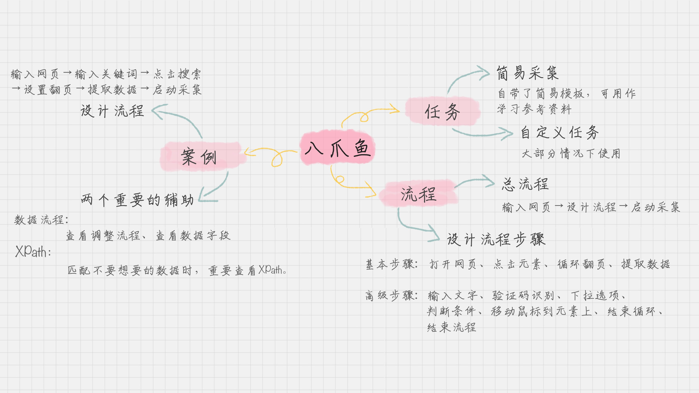

# 数据采集：如何使用八爪鱼采集微博上面的"D&G"评论

### **注意：下面的流程需要按实际情况来操作，不具备一般性。**
这个使用免费版的八爪鱼抓取评论时候，在微博没有登录的情况下是看不见分页的，这样就需要登录验证，而登录验证时候有一个验证码识别，八爪鱼是识别不出来的，这样就会导致抓取数据失败。同样，在豆瓣抓取电影《海王》的评论时，虽然不用登录，但是只能抓取12页左右的数据，同样需要登录才能将数据抓取完整。

## 八爪鱼的基本操作
### 自定义任务VS简易采集

### 流程步骤
采集数据只需要三步：
- 1、输入网页
- 2、设计流程
    - 点击元素
    - 循环翻页
    - 提取数据
- 3、启动采集

## 采集微博上的“D&G”的评论
- 1、输入网页
- 2、输入关键词
- 3、点击搜索
- 4、设置翻页
- 5、提取数据
- 6、启动采集

## 总结
主要是讲解八爪鱼的使用流程

