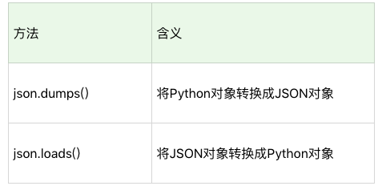
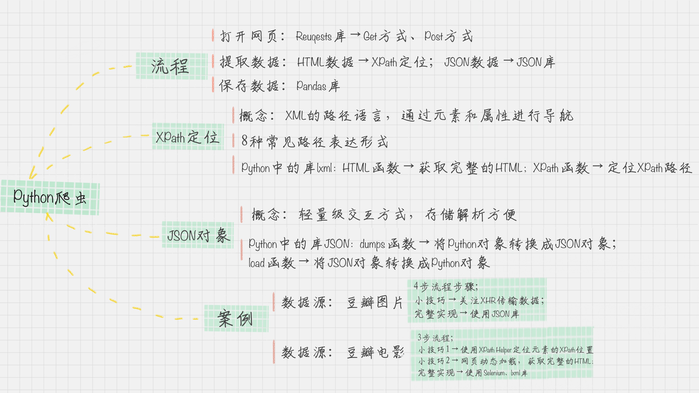

# Python爬虫：如何自动化下载王祖贤的海报

## 爬虫的主要流程
前面提到的爬虫实际上就是使用浏览器访问的方式模拟访问网站的过程，整个过程包括三个阶段：打开网页、提取数据和保存数据。

在Python中这三个阶段都有对应的工具可以使用。
- 打开网页：使用Requests访问页面，得到服务器返回给我们的数据，这里包括HTML页面和JSON数据。
- 数据提取：这里用到两个工具，针对HTML页面可以使用XPath进行元素的定位，提取数据；针对JSON数据，可以使用JSON进行解析。
- 保存数据：使用Pandas保存数据，最后导出CSV文件。

### Requests访问页面
Requests是Python HTTP的客户端库，编写爬虫的时候会用到，简单。使用的两种访问方式：Get和Post。这两者最直观的区别就是：Get把参数包含在url中，而post通过Request body 来传递参数。例如请求豆瓣
> r = requests.get('http://www.douban.com')

然后可以使用r.text或者r.content来获取HTML的正文。

同样，使用Post进行表单传递，代码可以这样写：
>r = requests.post('http://xxx.com', data = {'key':'value'})


这里的data就是传递的表单参数，data的数据类型是个字典结构，采用key和value的方式进行存储。


### XPath定位
Xpath是一种XML的路径语言，实际上是通过元素和属性进行导航，帮助我们定位。


例如：
- 1、xpath('node')选取node结点的所有子节点
- 2、xpath('/div')从根节点上选取div节点
- 3、xpath('//div')选取所有的div节点
- 4、xpath('./div')选取当前节点下的div节点；
- 5、xpath('...')返回上一个结点
- 6、xpath('//@id')选取所有的id属性
- 7、xpath('//book[@id]')选取所有拥有名字为id的属性的book元素
- 8、xpath('//book[@id="abc"]')选取所有的book元素，且这些book元素拥有id="abc"的属性；
- 9、xpath('//book/title|//book/price')选取book元素的所有的title和price元素。

使用xpath定位会使用到Python的一个解析库lxml。这个库的效率非常高，使用起来简单，只需要调用HTML解析命令即可，然后再对HTML进行XPath函数的调用。

例如定位到HTML中的所有列表项目：
```py
from lxml import etree
html = etree.HTML(html)
result = html.xpath('//li')
```

### JSON对象
JSON是一种轻量级的交互方式，在Python中有JSON库，可以让我们将Python对象和JSON对象进行转换。将JSON对象转换成为Python对象，我们对数据进行解析就更加方便了。



例如一段将JSON格式转换成为Python对象的代码：
```py
import json
jsonData = '{"a":1,"b":2,"c":3,"d":4,"e":5}';
input = json.loads(jsonData)
print input
```

通过两个角度使用Python抓取海报，一个是通过JSON数据抓取，一个是通过XPath定位抓取。

## 如何使用JSON数据自动下载王祖贤的海报

### 方式一：通过json格式数据进行抓取
- 1、首先是需要通过抓包，使用Chrome的网络分析工具F12，获得json格式的请求URL，这个链接也叫XHR：
> https://www.douban.com/j/search_photo?q=%E7%8E%8B%E7%A5%96%E8%B4%A4&limit=20&start=0

- 2、然后分析XHR，对url进行截取拼接
> url = 'https://www.douban.com/j/search_photo?q='+query+'&limit=20&start='+ str(i)

- 3、定义下载函数和调用下载函数，完整代码如下：
```py
# coding:utf-8
# 下载王祖贤的豆瓣图片
import requests
import json
query = "王祖贤"
'''下载图片'''
def download(src,id):
    # 将图片写到当前目录，原来的图片的格式是webp的，需要转换一下格式
    dir = './' + str(id) + '.jpg'
    try:
        pic = requests.get(src, timeout=10)
        fp = open(dir,'wb')
        fp.write(pic.content)
        fp.close()
    except requests.exceptions.ConnectionError:
        print('图片无法下载！')

'''for 循环 请求全部的url'''
for i in range(0, 24908, 20):
    url = 'https://www.douban.com/j/search_photo?q='+query+'&limit=20&start='+ str(i)
    html = requests.get(url).text       # 得到返回的结果
    response = json.loads(html,encoding='utf-8')  # 将json格式转换成为Python的对象
    for image in response['images']:  # 遍历得到的列表
        print(image['src']) # 查看当前下载的图片的地址
        download(image['src'],image['id'])  # 下载一张图片
```

### 方式二：通过XPath对页面的数据进行抓取
- 1、使用Xpath获取到页面的元素：
```py
srcs = html.xpath("//div/a[@class='nbg']/img/@src ")
titles = html.xpath("//div[@class='title']/h3/a/text()")
```
- 2、使用selenium库模拟浏览器，这里我使用的是Chrome浏览器，需要事先安装好selenium模块，然后下载ChromeDriver，它的作用是启动Chrome浏览器来进行模拟，ChromeDriver的下载地址是：
> https://sites.google.com/a/chromium.org/chromedriver/downloads

根据自己的浏览器版本下载对应的版本的驱动，不对的驱动的话会启动不了Chrome，将下载好的驱动放到指定的文件夹里面，后面会用到。

通过selenium启动Chrome的代码为：
```py
# 配置selenium
from selenium import webdriver
driver = webdriver.Chrome()
driver.get(request_url)
```
- 3、接着就是启动程序，调用之前定义好的下载图片的函数，完整代码如下：
```py
# coding:utf-8
# 下载王祖贤的电影封面海报
import requests
import json
from lxml import etree

# 配置selenium
from selenium import webdriver
# options = webdriver.ChromeOptions()
# options.add_argument("--incognito")  # 隐身模式打开
# driver_path = "/home/toohoo/Desktop/chromedriver_linux64/chromedriver"  # chromedriver的路径
driver = webdriver.Chrome("/home/toohoo/Desktop/chromedriver_linux64/chromedriver")

query = "王祖贤"
'''下载图片'''
def download(src,id):
    # 将图片写到当前目录，原来的图片的格式是webp的，需要转换一下格式
    dir = './' + str(id) + '.jpg'
    try:
        pic = requests.get(src, timeout=10)
        fp = open(dir,'wb')
        fp.write(pic.content)
        fp.close()
    except requests.exceptions.ConnectionError:
        print('图片无法下载！')

'''for 循环 请求全部的url'''
request_url = 'https://www.douban.com/search?cat=1002&q=' + query
driver.get(request_url)

# 注意是这样写的！
html = etree.HTML(driver.page_source)

srcs = html.xpath("//div/a[@class='nbg']/img/@src ")
titles = html.xpath("//div[@class='title']/h3/a/text()")

for src,title in zip(srcs, titles):
    # 调用的时候记得转换编码！！
    download(src, title.encode("utf-8"))
```

这里说一下遇到的问题：
- 1、我的环境是Ubuntu18.04的，启动的时候发现启动不了Chrome浏览器，后来发现驱动是可以直接运行的，在Linux下使用`./chromedriver`直接就可以运行了，在win下也是可以运行的.exe文件。然后在另一个窗口接着运行`python wzxPostSpider.py`就行。
- 2、海报图片文件的编码问题，默认使用中文命名，如果不经过转码的话会出现编码错误，这里需要带调用下载函数的时候进行转码，转成`utf-8`的形式：
```py
for src,title in zip(srcs, titles):
    # 调用的时候记得转换编码！！
    download(src, title.encode("utf-8"))
```

## 总结：本讲知识
- 1、Python爬虫的流程。
- 2、了解XPath定位，JSON对象解析；
- 3、如何使用lxml库，进行XPath的提取；
- 4、如何使用Python中使用Selenium库来模拟浏览器，获取完整的HTML。

其中，Python+Selenium+第三方浏览器可以让我们处理多种复杂的场景，包括网页的动态加载、js响应、Post表单等。因为Selenium模拟的就是一个真实的用户的操作行为，就不用担心cookie追踪和隐藏字段的干扰了。

同时，Python还给我们提供了数据的处理工具，比如lxml库和JSON库，这样我们就可以提取想要的内容了。




