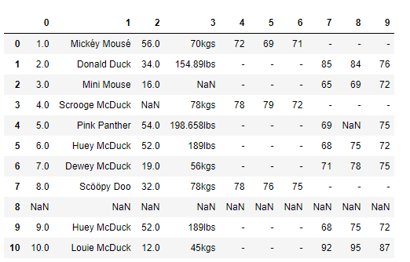
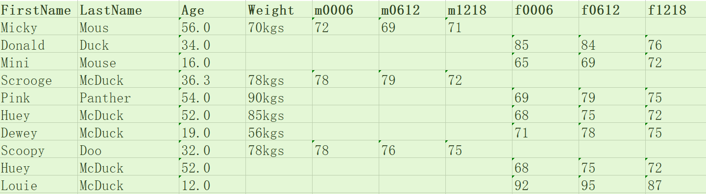
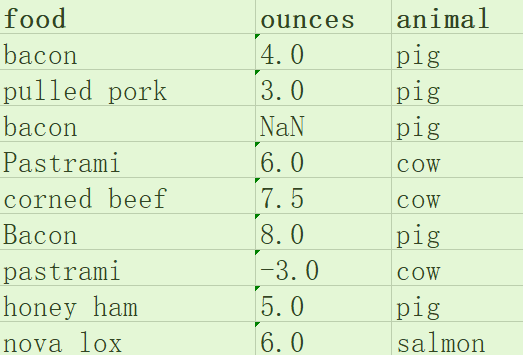

# 数据科学家80%的时间都花在数据清洗任务上面
好的数据分析师必定是一名数据清洗高手，要知道在整个数据分析的过程中，不论是在时间还是功夫上，数据的清洗大概都占用到了80%。

## 数据质量的标准
总结为4个关键点,统一起来是“完全合一”。
- 1、完整性：单条数据是否为空值，统计的字段是否完善。
- 2、全面性：观察某一列的全部数值，比如在Excel表中，选中其中的一列，可以看到该列的平均值、最大值、最小值。我们可以通过常识来判断该列是否有问题，比如数据定义、单位标识、数值本身。
- 3、合法性：数值的类型、内容、大小的合法性。比如数据中存在非ASCII字符，性别存在了未知，年龄超过了150岁等。
- 4、唯一性：数据是否存在重复的记录，因为数据通常来自与不同的渠道的汇总，重复的情况是很常见的。行数据、列数据都需要是唯一的，比如一个人不能重复记录多次，且一个人的体重也不能在列指标中重复记录多次。

例如有以下的数据：

目标：数据标准、干净、连续。


## 清洗数据，一一击破
### 1、完整性
#### 问题1：缺失值
例如有年龄、体重数值是缺失的，这往往由于数据量大而没有采集到，我们可以使用以下三种方式处理：
- 1、删除：删除数据的缺失的记录；
- 2、均值：使用当前列的均值；
- 3、高频：使用当前列的出现的频率最高的数据

比如我们想要对df['Age']中缺失的数值使用平均年龄进行填充：
```py
df['Age'].fillna(df['Age'].mean(), inplace=True)
```
如果我们使用高频的数据进行填充，可以先通过value_counts获取Age字段最高频次age_maxf,然后再对Age字段中的缺失的数据使用age_maxf进行填充：
```py
age_maxf = df['Age'].value_counts().index[0]
df['Age'].fillna(age_maxf, inplace=True)
```
#### 问题2：空行
如果发现数据中有一个空行，除去index之外，全部是NaN。Pandas的read_csv()并没有可选参数来忽略空行，这样，我们需要在数据被读入之后再使用dropna()进行处理，删除空行。注意，在前面如果填补上年龄了，就不算是空行了，所以要先注释，说明数据清洗需要一步步来。
```py
#删除空行
df.dropna(how='all',inplace=True)
```

### 2、全面性
#### 问题：列数据的单位不统一
观察weight列的数值，会发现weight列的单位不统一。有的单位是千克（kgs）,有的单位是磅(lbs)。

这里使用千克作为统一的度量单位，将磅（lbs）转化为千克（kgs）：
```py
# 获取weight数据列中单位为lbs的数据
rows_with_lbs = df['weight'].str.contains('lbs').fillna(False)
print df[rows_with_lbs]
# 将lbs转换为kgs，2.2lbs=1kgs
for i,lbs_row in df[rows_with_lbs].iterrows():
    # 截取从头开始到倒数的第三个字符之前，即去掉lbs,转化为kg。
    weight = int(float(lbs_row['weight'][:-3])/2.2)
    df.at[i,'weight'] = '{}kgs'.format(weight)
```
### 3、合理性
#### 问题：非ASCII字符
我们可以看到在数据集中Firstname和lastname有一些非ASCII的字符串。我们可以采用删除或者替换的方式来解决非ASCII问题，这里使用删除的方法：
```py
# 删除非ASCII字符
df['first_name'].replace({r'[^\x00-\x7F]+':''},regex=True, inplace=True)
df['last_name'].replace({r'[^\x00-\x7F]+':''},regex=True, inplace=True)
```
### 4、唯一性
#### 问题1：一列有多个参数
在数据中不难发现，姓名列（name）包含了两个参数Firstname和lastname两个字段。为了达到数据的整洁的目的。可以将Name列拆分为Firstname和Lastname两个字段。我们使用Python的split方法，str.split(expand=True),将列表拆成新的列，再将原来的Name列删除。
```py
# 切分名字，删除源数据列
df[['first_name','last_name']] = df['name'].str.split(expand=True)
df.drop('name',axis=1,inplace=True)
```
#### 问题2：重复数据
我们校验一下数据中是否存在重复的记录。如果存在重复的记录，就使用Pandas提供的drop_duplicates()来删除重复的数据。
```py
#删除重复的数据行
df.drop_duplicates(['first_name','last_name'],inplace=True)
```

#### 经过数据清洗之后的数据展示


## 养成数据审核的习惯
- 源数据是脏的，要清洗
- 没有高质量的数据，就没有高质量的数据挖掘，而数据清洗是高质量数据的第一道屏障。
- 清洗数据需要耐心
- 总结：


**按照上面的步骤操作了一遍：**
- [按照完全合一的方式进行的操作](dataclean.py) ---[源数据集](data1.xlsx)---[清洗完成之后的数据](data2.xlsx)
- [按照非完全合一的顺序，而是实际需要的方式的操作](dataclean1.py) --[清洗完成之后的数据集](data3.xlsx)


## 课后习题
- 清理美食数据：


[源代码](fooddataclean.py)-[源数据](food1.xlsx)-[清洗后数据](food2.xlsx)

参考了评论的一些解答：
```py
# encoding=utf-8
# 这个文件考虑到使用“完全合一”的原则从头到尾清理数据存在问题，
# 所以这里是使用的顺序是不同“完全合一”的乱序
import pandas as pd
from pandas import Series, DataFrame
data = DataFrame(pd.read_excel('food1.xlsx'))
df = DataFrame(data)
# 在没有清洗之前，两种方式输出的数据是一样的，
# 清洗过后只是输出对应数据的修改，并没有修改源文件的数据，所以后期需要将清洗后的数据进行保存
print(df)


# 1、去除空行,参数how=all的意思是行内所有值都为空的时候才删除
# df.dropna(how='all', inplace=True)
# 没有参数的时候就是行内有空值NaN的时候都删掉,
# 删掉有NaN的的Bacon
df = df.dropna()
# 删除之后需要重新调整index，使其有序
df.index = range(len(df)) # reset index

# 2、标题行首字母大写
df.columns = df.columns.str.title()

# 3、每一行的第一列首字母大写
# 如果需要操作行的元素的话应该这样操作
df['Food'] = df['Food'].str.title()

# 4、不能简单去掉重复行，这是份菜单，
# 为了保险，值应该取平均值之后再删除重复的行
# df.loc[0,'Ounces'] 意思是定位到Ounces列的第一行的值，1：第二行，2：第三行
df['Ounces'] = df['Ounces'].apply(lambda a:abs(a))
df.loc[0,'Ounces'] = df[df['Food'].isin(['Bacon'])].mean()['Ounces']
# 输出第四行的Bacon
df.drop(df.index[4],inplace=True)
df.index = range(len(df)) # reset index
# df.drop_duplicates(['Food'],inplace=True)


# 5、继续处理重复行：Pastrami
# 获取pastrami的平均值,赋值给第一个值，同时删除第二个值,但是第二个是负值，
# 不合法，也不能简单的求平均值，先转成正数，再算平均值,使用apply函数和匿名函数
df['Ounces'] = df['Ounces'].apply(lambda a:abs(a))
df.loc[2,'Ounces'] = df[df['Food'].isin(['Pastrami'])].mean()['Ounces']
df.drop(df.index[4],inplace=True)
# 重置index
df.index = range(len(df))
print(df)
```

