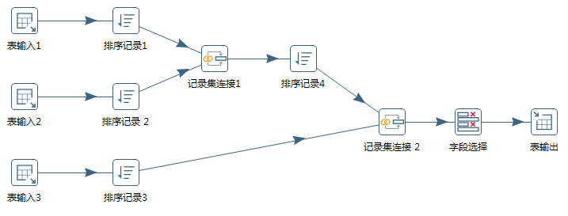
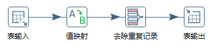
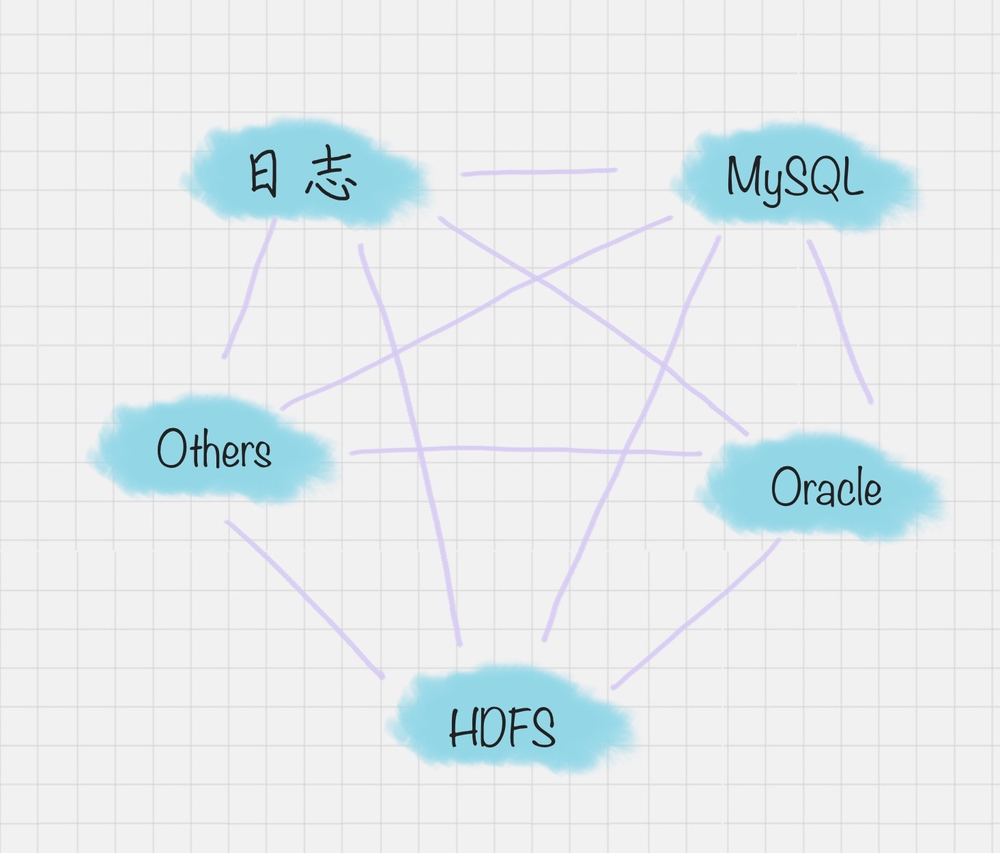
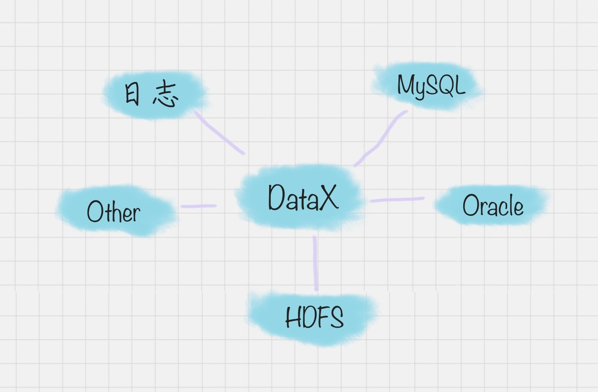
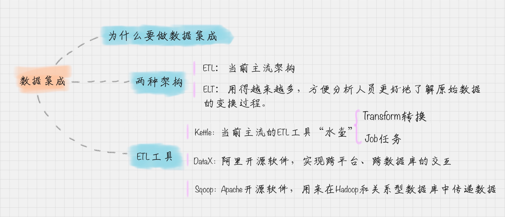

# 数据集成：这些大号一共20亿粉丝？

通过明星引入数据集成的概念（数据有重复，需要集成！）

**数据集成：** 数据集成就是将多个数据源合并存放到一个数据存储中（如数据仓库），从而方便后续的数据挖掘工作。

数据集成的广泛意义：数据清洗、数据抽取、数据集成、数据转换等操作。

### 数据集成的两种架构：ELT和ETL
工作目的：数据集成的工作包括：
- 1、数据的ETL
- 2、数据挖掘算法的实现。

**ETL**：英文是：Extract、Transform和load的缩写，顾名思义就是数据抽取、转换、加载三个过程。

- 1、抽取：将数据从已有的数据源中抽取出来
- 2、转换：对原始数据进行处理，例如将表输入1和表输入2进行连接形成一张新的表。

- 如果是三张表：可以先将表1和表2进行连接形成表1-2，然后将表输入1-2和表输入3进行连接形成新的表。然后将生成的新的表写入目的地

根据转换发生的顺序和位置，数据集成可以分为ETL和ELT两种架构。

ELT的过程为提取(Extract)--转换(Transform)--加载(load),在数据源抽取之后首先进行转换，然后将转换的结果写入目的地。

ELT的过程则是提取(Extract)--加载(Load)--变换(Transform),在抽取后将结果先写入到目的地，然后利用数据库的聚合分析能力或者外部的计算架构，如spark来完成转换的步骤。

- ELT和ETL相比，最大的区别就是“重抽取和加载，轻转换”，从而可以用更加轻量的方案搭建起一个数据集成平台。使用ELT方法，在提取完成之后，数据加载会立即开始。一方面更加省时，另一方面ELT允许BI分析人员无限制地访问整个原始数据，为分析师提供了更大的灵活性，使能更好的支持业务。
- 在ELT架构中，数据的变换这个过程根据后续的情况，需要在SQL中进行，而不是在加载阶段进行。这样做的好处是你可以从数据源中提取数据，经过少量的预处理后进行加载。这样的架构更加简单。使得分析人员更好的了解原始数据的变换过程。

#### ETL工具有哪些？

- 商业软件：Informatica PowerCenter、IBM InfoSphere DataStage、Oracle Data Integrator、Microsoft SQL Server Integration Service等。

- 开源软件：Kettle、Talend、Apatar、Scriptella、DataX、Sqoop等。

### Kettle 工具的使用入门
- Transformation(转换)：相当于一个容器，对数据进行了定义。数据的操作就是数据从输入到输出的一个过程。（比作业粒度更小的容器，把任务分解成为不同的作业，然后再把作业分解成多个转换。）
- Job(作业)：相比于转换是个更大的容器，它负责将转换组织起来完成某项作业。

#### 如何创建Transformation(转换)
Transformation可以分成三个步骤，它包括了输入、中间转换以及输出。

在Transformation中包括两个主要的概念：Step（步骤）和Hop（跳跃线）。
- Step(步骤)：Step是转换的最小单位，每一个Step完成一个特定的功能。在上面这个转换中，就包括了表的输入、值的映射、去除重复的记录、表输出这4个步骤。
- Hop(跳跃线)：用来在转换中连接Step。它代表了数据的流向。

#### 如何创建Job(作业)
完整的任务，实际上是将创建好的转换和作业串联起来。在这里的Job包括两个概念：
- Job Entry(工作实体)：Job Entry是job内部的执行单元，每一个Job Entry都是用来执行具体任务的，比如调用转换，发送邮件等。
- Hop：指的是连接Job Entry的线。并且它可以指定是否有条件的执行

在Kettle中，那可以使用Spoon，它是一种图形化的方式，来让你设计Job和Transformation，并且可以保存为文件或者保存在数据库中。

#### 案例1：如何将文本文件的内容转化到MySQL数据库中

- 具体的操作方法根据实际的形式而定！

### 阿里开源软件：DataX
在以往的数据库中，数据库都是两两之间进行的转换，没有统一的标准，转换的形式是这样的：

但是DataX可以实现跨平台、跨数据库、不同的系统之间的数据同步以及交互，它将自己作为标准，连接了不同的数据源，以完成他们之间的转换。

DataX的模式是基于框架+插件完成的，DataX的框架如下：

在这个框架中，Job作业被Splitter分割成为许多的小的作业Sub-job。在DataX里面，通过两个线程的缓冲池来完成读和写的操作，读和写都是通过Storage完成数据的交换的。比如在“读”模块。切分之后的小作业，将数据从源头装载到DataXStorage，然后在“写”模块，数据从DataXStorage导入到目的地。

这样的好处就是，在整体的框架下。我们可以对Reader和Writer进行插件扩充，比如像从MySQL导入到Oracle，就可以使用MySQLReader和OracleWriter，装在框架上使用即可。

### Apache开源软件：Sqoop
Sqoop是一款开源的工具，是由Apache基金会所开发的分布式系统的基础框架。Sqoop在Hadoop生态系统中是由一席之地的，它主要用来在Hadoop和关系型数据库中传递数据。
通过Sqoop，我们可以方便的将数据从关系型数据库导入到HDFS中，或者将数据从HDFS中导出到关系型数据库中。

Hadoop实现了一个分布式的文件系统。即HDFS。Hadoop框架的最核心的设计就是HDFS和MapReduce。HDFS为海量的数据提供了存储，而MapReduce则为海量的数据提供了计算。

### 总结：
- 两种架构方式：ELT和ETL。
- Kettle的使用：具体的方式参考官网文档。根据实际情况而变化。
- 两种工具的介绍：DataX和Sqoop。

