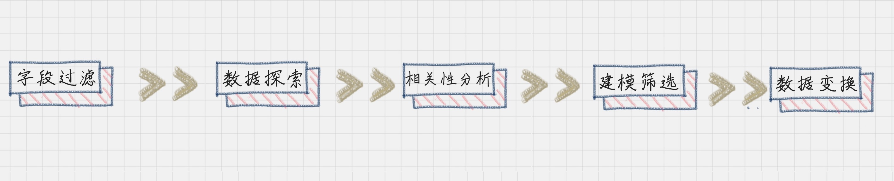
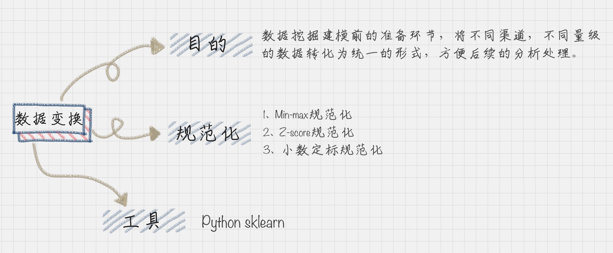

# 数据变换：考试成绩要求正态分布合理否？

有正态分布知识引：多数人的成绩位于正态分布的中间，少数的位于两头。

## 数据变换在数据分析中的角色
由于不同渠道获取到的数据不同，所以我们需要进行数据变换。

数据变换比算法选择更加重要，数据错了，算法再正确也是错误的。

如何让不同渠道取到的数据统一到一个目标数据库————数据变换

在数据变换之前，我们需要先**对字段进行筛选**，然后  对数据进行**探索**和**相关性分析**，接着是**选择算法模型**，然后针对算法模型对数据的需求进行**数据的变换**，从而完成数据挖掘前的准备工作。



数据变换是数据准备的重要环节，通过**数据平滑**、**数据聚集**、**数据概化**和**规范化**等方式将数据转换成为适用于数据挖掘的形式。

- 1、**数据平滑：** 去除数据中的噪声，将连续数据离散化。这里可以采用分箱、聚类和回归的方式进行数据平滑（聚类和回归）。
- 2、**数据聚集：** 对数据进行汇总，在SQL中有一些聚集函数可以供我们操作，比如Max()反馈某个字段的数值的最大值，Sum()返回某个字段的数值总和；
- 3、**数据概化：** 将数据由较低的概念抽象成为较高的概念，减少数据复杂度，即用更高的概念替代更低的概念。比如说：上海、杭州、深圳、北京可以概化为中国。
- 4、**数据规范化：** 使属性数据按照比例缩放，这样就将原来的数值映射到一个新的特定的区域中。常用的方法有最小--最大规范化，Z--score规范化、按小数定标规范化等。
- 5、**属性构造：** 构造出新的属性并添加到属性集合中。这里会用到特征工程的知识。因为通过属性与属性的链接构造新的属性，其实就是特征工程。比如说，数据表中统计每个人的英语、语文和数学的成绩，就可以构造出一个“总和”这个属性，来作为新的属性。这样“总和”这个属性就可以用到后续的数据挖掘计算中。

## 数据规范化的几种方法

**1、Min-max 规范化**

Min-max规范化方法是将原始的数据变换到[0,1]的空间中。使用公式表示就是：

新数值 = (原数值-极小值)/(极大值-极小值)。

**2、Z-Score规范化**
假设A与B的考试成绩都是80分，A的考卷满分是100分(及格60分)，B的考卷满分是500分(及格300分)。虽然两个人都考了80分，但是A的80分与B的80分代表完全不同的含义。

**Z-Score规范化** 就是用来标准化这类型的数据的，使得这类问题得到解决。

新数值 = (原数值-均值) / 标准差

假设A所在的班级的平均分是80分，标准差为10.B所在的班级的平均分是400，标准差是100.那么A的新数值=(80-80)/10=0，B的新数值=(80-400)/100=-3.2

那么在Z-Score标准下，A的成绩会比B的成绩好。

我们能看到Z-Score的优点是算法简单，不受数据量级的影响，结果易于比较。不足在于，他需要数据整体的平均值和方差，而且结果没有实际的意义，只能用于比较。

**3、小数定标规范化**
小数定标规范化就是通过一定小数点的位置来进行规范化。小数点移动多少位取决于属性A的取值中的最大绝对值。

**例如** 属性A的取值范围是-999到88，那么最大绝对值为999，小数点就会移动3位，即新数值=原数值/1000。那么A的取值范围就会被规范化为-0.999到0.088


## Python的SciKit——Learn库的使用

SciKit-Learn是Python的重要机器学习库，它帮助我们封装了大量的机器学习算法，比如分类、聚类、回归、降维等。此外，它还包括了数据变换模块。

**1、Min-max规范化**
可以让原始的数据投射到指定的空间[min,max],在SciKit-Learn里面有个函数MinMaxScaler是专门做这个的，它允许我们给定一个最大值和最小值，然后将源数据投射到[min,max]中。默认的情况下[min,max]是[0,1],也就是把原数据投放到[0,1]范围内。

**举个例子**
```py
# coding:utf-8
from sklearn import preprocessing
import numpy as np

# 初始化数据，每一行表示一个样本，每一列表示一个特征
x = np.array([[0., -3., 1.],
              [3., 1.,  2.],
              [0., 1., -1.]])

# 将数据进行[0,1]规范化
min_max_scaler = preprocessing.MinMaxScaler()
minmax_x = min_max_scaler.fit_transform(x)
print minmax_x
```
```py
# 运行结果是：
[[0.         0.         0.66666667]
 [1.         1.         1.        ]
 [0.         1.         0.        ]]
```
**解析：**
上面的Min-max的计算方法是按照列来进行的，例如：第三列的值0.666667的计算方法是：先计算该列的最小值-1和最大值2的差值（大减小）为3，然后取得该位置的1值，减去最小值-1得到2。2/3=0.6666667。其他的位置1、0也是一样。

**2、Z-Score规范化**
在SciKit-Learn库中使用怕热processing.scale()函数，可以直接将给定的数据进行Z-Score规范化。
```py
# coding:utf-8
from sklearn import preprocessing
import numpy as np

# 初始化数据
x = np.array([[0., -3., 1.],
              [3., 1.,  2.],
              [0., 1., -1.]])

# 将数据进行Z-Score规范化
scaled_x = preprocessing.scale(x)
print scaled_x

# 运行结果：
[[-0.70710678 -1.41421356  0.26726124]
 [ 1.41421356  0.70710678  1.06904497]
 [-0.70710678  0.70710678 -1.33630621]]
```
结果实际上就是将每行每列的数值减去平均值，再除以方差的结果。

例如第三列的第一个0.26726124的计算方是：先计算均值x = (1+2-1)/3=2/3,再计算方差S^2 = [(1-2/3)^2+(2-2/3)^2+(-1-2/3)^2]/3=14/9,那么S = (14/9)^0.5=1.247219128,那么新值=(1-2/3)/S=0.26726124,其他的类似。

我们看到Z-Score规范化将数据集进行了规范化，数值都符合均值为0，方差为1的正态分布。

**3、小数定标规范化**
需要使用Numpy库来计算小数点的位数。如：
```py
# coding:utf-8
# 小数定标
from sklearn import preprocessing
import numpy as np

# 初始化数据
x = np.array([[0., -3., 1.],
              [3., 1.,  2.],
              [0., 1., -1.]])

# 将数据进行小数定标规范化
# 先取得最大值的绝对值，然后将其转化成为小数，获取指数j
j = np.ceil(np.log10(np.max(abs(x))))
scaled_x = x/(10**j)
print scaled_x

# 运行结果
[[ 0.  -0.3  0.1]
 [ 0.3  0.1  0.2]
 [ 0.   0.1 -0.1]]
```

## 数据挖掘中数据变换比算法选择更重要
- 数据需要规范化，例如考试的成绩，这样我们才能进行数据挖掘。这也是数据变换的作用。

- 否则，要不就是维数过多，增加了计算的成本，要不就是数据过于集中，难以找到数据之间的特征。

- 在数据变换中，重点是如何对数据进行规范化，有三种常用的方法，分别是：Min-max规范化、Z-Score规范化、小数定标规范化。其中Z-Score规范化可以直接将数据转化为正态分布的情况。当然不是所有的自然数据都需要正态分布，要根据实际情况来进行设计，比如对数log，或者神经网络里面采用的激励函数。

- 要懂得使用python的sklean库，它和Numpy，Pandas都是非常出名的，在数据统计工作中齐了很大的作用。SciKit-Learn不仅可以用于数据变换，它还提供了分类、聚类、预测等数据挖掘算法的API封装。



## 课后练习

```py
# coding:utf-8
#数据变换
from sklearn import preprocessing
import numpy as np
#初始化数据
min = 5000.
max = 58000.
income = 16000.
# 只要标记处那个是要变换的就行，例如最后可以打印出整个变换后的数组，也可以单独打印出目标数字的转换结果。
x = np.array([[min], [max], [income]])
#将数据[0 1]规范化
min_max_scaler = preprocessing.MinMaxScaler()
minmax_x = min_max_scaler.fit_transform(x)
print((minmax_x))
print((minmax_x)[2])
```
