# 一次性学会Python数据可视化的10种技能

## 可视化视图都有哪些？

可视化视图可以分成4大类：比较、联系、构成和分布。他们的特点如下：

1、比较：比较数据之间的各类别的关系，或者是他们随着时间的变化趋势，比如折线图；

2、联系：查看两个或者两个以上的变量之间的关系，比如散点图；

3、构成:每个部分占整体的百分比，或者是随着时间的百分比变化，比如饼状图；

4、分布：关注单个变量，或者多个变量的分布情况，比如直方图。

同样，按照变量的个数，可以把可视化视图划分成为单变量分析和多变量分析：
- 1、单变量分析指的是一次只关注一个变量。比如只关注“身高”这个变量，来看身高的取值分布，而暂时忽略其他的变量。
- 2、多变量分析可以让我们在一张图上查看两个以上的变量的关系。比如身高和年龄。可以理解为是同一个人的两个参数，这样在同一张图中可以看到每个人的身高和年龄的取值，从而可以分析出这两个变量之间是否存在某种联系。

可视化的视图分门别类，主要有下面的10中比较常用：散点图、折线图、直方图、条形图、箱型图、饼图、热力图、蜘蛛图、二元变量分布和成对关系。


## 1、散点图


```
import matplotlib.pyplot as plt

plt.scatter(1, 2, marker="o") # mark的值可以设置为"x",">","o"
plt.show()
```


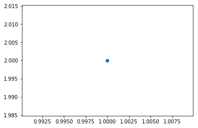


上面使用的是Matplotlib库，下面也可以使用seaborn这个更高级的库
```py
import seaborn as sns
 # data就是我们需要传入的数据，数据是DataFrame类型，scatter 代表散点的意思，kind可以取其他的值，代表不同的绘制方式
sns.jointplot(x,y,data=None,kind='scatter')
```


```
import numpy as np
import pandas as pd
import matplotlib.pyplot as plt
import seaborn as sns
# 数据准备
N = 1000
x = np.random.randn(N)
y = np.random.randn(N)
# 使用 Matplotlib 画散点图
plt.scatter(x,y,marker='x')
plt.show()
# 使用seaborn 画散点图
df = pd.DataFrame({'x':x,'y':y})
sns.jointplot(x="x",y="y",data=df,kind='scatter');
plt.show()
```


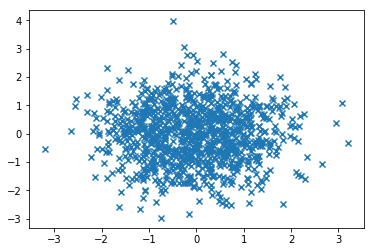


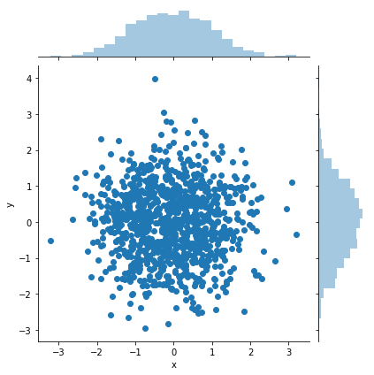


## 2、折线图

在Matplotlib中，我们可以直接使用plt.plot()函数，当然可以需要提前把数据按照x轴的大小进行排序，否则画出来的折线图就无法按照x轴递增的顺序展示

在Seaborn中，可以使用sns.lineplot(x,y,data=None)函数。其中x，y是data中的下标。data就是我们要传入的数据，一般是DataFrame的类型。

这里我们设置了x，y的数组。x数组代表时间（年），y数组可以随便设置几个取值


```
import pandas as pd
import matplotlib.pyplot as plt
import seaborn as sns
# 数据准备
x = [2010,2011,2012,2013,2014,2015,2016,2017,2018,2019]
y = [5,3,6,20,17,16,19,30,32,35]
# 使用Matplotlib画出折线图
plt.plot(x,y)
plt.show()
# 使用Seaborn画出折线图
df = pd.DataFrame({'x':x,'y':y})
sns.lineplot(x='x',y='y',data=df)
plt.show()
```


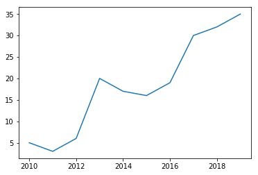


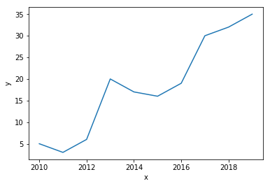


从上面可以看出两个图像的形状是完全一样的，只是在seaborn中标记了x和y。

## 3、直方图

直方图是比较常见的视图，它是吧横坐标等分成了一定数量的小区间，这个小区间也加“箱子”，然后在每一个“箱子”内部使用矩形条（bars）展示该箱子的箱子数（也就是y值），这样就完成了对数据集的直方图分布的可视化。

在Matplotlib中，我们使用plt.hist(x,bin=10)函数，其中参数x是一维数组，bins代表直方图中箱子的数量，默认是10.

在Seaborn中，我们使用sns.distplot(x,bins=10,kde=True)函数。其中参数x是一堆数组，bins代表直方图中的箱子数量，kde代表显示核密度估计，默认是true，我们也可以把kde设置为False，不进行显示。核密度估计是通过该函数帮助我们来估计概率密度的方法。


```
import numpy as np
import pandas as pd
import matplotlib.pyplot as plt
import seaborn as sns
# 数据准备
a = np.random.randn(100)
s = pd.Series(a)
# 使用Matplotlib画直方图
plt.hist(s)
plt.show()
# 使用Seaborn 画直方图
sns.distplot(s, kde=False)
plt.show()
# 进行核密度估计
sns.distplot(s,kde=True)
plt.show()
```


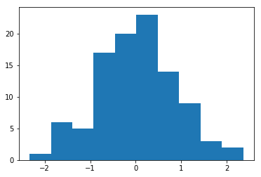


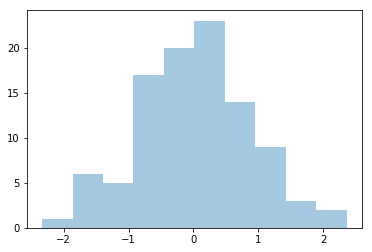


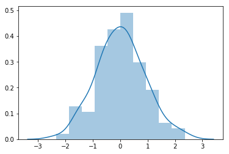


## 4、条形图

如果说通过直方图可以看到变量的数值分布，那么条形图可以帮助我们查看类别的特征。在条形图中，长条形的长度表示类别的频度，宽度表示类别

在Matplotlib中，使用plt.bar(x,height)函数，其中参数x代表x轴的位置的序列，height是y轴的数值序列，也就是柱子的高度。

在Seaborn中，我们使用sns.barplot(x=None,y=None,data=None)函数。其中参数data为DataFrame类型，x,y是data中的变量。


```
import matplotlib.pyplot as plt
import seaborn as sns
# 数据准备
x = ['Cat1','Cat2','Cat3','Cat4','Cat5']
y = [5,4,8,12,7]
# 使用Matplotlib画条形图
plt.bar(x,y)
plt.show()
# 使用Seaborn画条形图
sns.barplot(x,y)
plt.show()

```


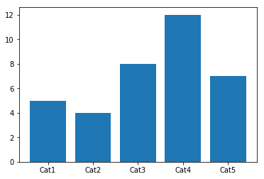


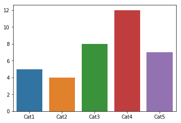


## 5、箱线图

箱线图，又称为盒式图，由五个数值组成：最大值（max）、最小值（min）、中位数（median）和上下四分位数（Q3，Q1）。它可以帮我们分析出数据的差异性、离散程度和异常值等。

在Matplotlib中。使用plt.boxplot(x,lablels=None)函数，其中参数x代表绘制箱线图的数据，labels是缺失值，可以为箱线图添加标签。

在Seaborn中。使用sns.boxplot(x=None,y=None,data=None)函数。其中参数data为DataFrame类型，x,y是data中的变量。


```
import numpy as np
import pandas as pd
import matplotlib.pyplot as ptl #不导入.pyplot也没事
import seaborn as sns

# 数据准备
# 生成 0-1 之间的 10 * 4 维度的数据
data = np.random.normal(size=(10,4))
labels = ['A','B','C','D']
# 使用Matplotlib画出箱线图
plt.boxplot(data, labels = labels)
plt.show()
# 使用Seaborn 画出箱线图
df = pd.DataFrame(data, columns = labels)
sns.boxplot(data=df)
plt.show()
```


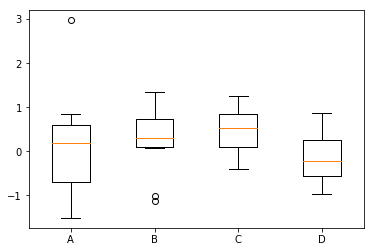


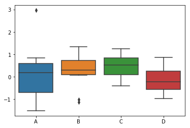


在上面的代码中，生成0-1之间的10*4维度的数据，然后分别使用Matplotlib和Seaborn进行箱线图的绘制。

## 6、饼图

饼图是常用的统计学模块，可以显示每个部分大小与总和之间的比例。在Python的数据可视化中，其实用的并不算多，主要是使用Matplotlib的pie函数来实现它。

在Matplotlib中，使用plt.pie(x,labels-None)函数，其中参数x代表要绘制饼图的数据，labels是缺省值，可以为饼图添加标签。

这里设置了数组labels，分别代表高中、本科、硕士、博士和其他的几种学历的分类标签。nums代表这些学历对应的人数。


```
import matplotlib.pyplot as plt
%matplotlib inline
# 数据准备
nums = [25,37,33,37,6]
labels = ['Hight-school','Bachelor','Master','Ph.d','Others']
# 使用Matplotlib画出饼图
plt.pie(x=nums,labels=labels)
plt.show()
```


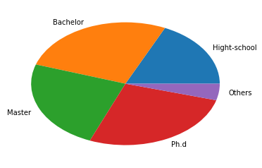


## 7、热力图

热力图，英文名称为heat map，是一种矩阵的表示方法，其中矩阵中的元素值用颜色来代表，不同的颜色代表不同大小的值。通过颜色就能直观的知道某个位置上的值的大小。另外你也可以将这个位置上的颜色与数据集中的其他位置的颜色进行比较

热力图是一种非常直观的多元变量分析方法。

一般使用Seaborn的sns.heatmap(data)函数，其中data代表需要绘制的热力图数据

这里使用Seaborn中自带的数据集flights，该数据记录了1949年到1960年间，每个月的航班乘客的数量。

**python2的数据加载不出来:**
版本问题or在线加载数据问题！，python2的版本太旧了使用下面的方式加载内置数据集失败，所以先到GitHub上面将数据集先下载保存到本地，再进行读取！
```py
# flights = sns.load_dataset("flights") 
```


```
import matplotlib.pyplot as plt
import seaborn as sns
import pandas as pd
from pandas import Series, DataFrame

%matplotlib inline
# 数据准备
# flights = sns.load_dataset("flights") 
flights = DataFrame(pd.read_csv("./seaborn_dataset/flights.csv"))
data=flights.pivot('year','month','passengers')
# 用 Seaborn 画热力图
sns.heatmap(data)
plt.show()

```


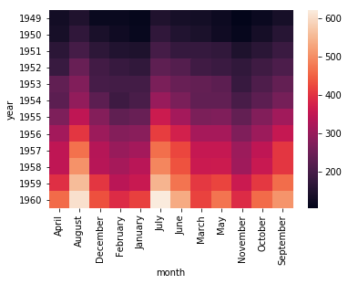


通过上面的图seaborn的heatmap函数，可以看到不同的年份，不同的月份的乘客数量的变化情况，其中颜色浅越浅的代表乘客的数量越多。

## 8、蜘蛛图

蜘蛛图显示的是一种一对多关系的方法。在蜘蛛图中，一个变量相对于另一个变量的显著性是清晰可见的。

假设我们需要给王者荣耀的玩家做一个战力图，指标一共包括推进、KDA、生存、团战、发育和输出的方法应该如何。

我们需要使用Matplotlib来进行画图，首先设置两个数组：labels和stats。他们分别保存这些属性的名称和属性值。

因为蜘蛛图是一个圆形，需要计算每个坐标的角度，然后对这些数值进行设置，所以要设定stats数组。并且需要在原有的angles和stats数组上增加一位，也就是添加数组的第一个元素。


```
import numpy as np
import matplotlib.pyplot as plt
import seaborn as sns
from matplotlib.font_manager import FontProperties
# 数据准备
labels = np.array([u"推进","KDA",u"生存",u"团战",u"发育",u"输出"])
stats = [83,61,95,67,76,88]
# 画图数据准备，角度、状态值
angles = np.linspace(0, 2*np.pi, len(labels), endpoint=False)
stats = np.concatenate((stats,[stats[0]]))
angles = np.concatenate((angles,[angles[0]]))
# 用 matplotlib 画出蜘蛛图
# 创建一个空白的对象
fig = plt.figure()
# 把画板分成一行一列
ax = fig.add_subplot(111, polar=True)
# 给图像上色
ax.plot(angles, stats, 'o-', linewidth=2)
ax.fill(angles, stats, alpha=0.25)
# 设置中文字体
font = FontProperties(fname=r"/usr/share/fonts/truetype/arphic/uming.ttc",size=14)
ax.set_thetagrids(angles * 180/np.pi, labels, FontProperties=font)
plt.show()
```


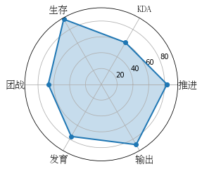


代码中flt.figure是创建一个空白的figure对象，这样做的目的是相当于在画画前先准备一个空白的画板。然后add_subplot(111)可以把画板划分成为1行1列。再使用ax.plot和ax.fill进行连线以及给图形上色。最后我们在相应的位置上显示出属性名。这里需要用到中文，Mapplotlib对中文的显示不是很友好，所以需要设置中文字体font，这个需要在调用前进行定义。使用fc-list :lang=zh命令可以将系统的中文字体列举出来。

## 9、二元变量分布

如果想要查看两个变量之间的关系，就需要用到二元变量分布。当然二元变量分布有多种呈现的方式，例如开头的散点图就是二元分布的一种。

在Seaborn里面使用二元分布是非常方便的，直接使用sns.jointplot(x,y,data=None,kind)函数即可。其中kind表示不同的视图类型：“kind=scatter”代表散点图，"kind = 'kde'"代表核密度图，"kind = 'hex'"代表的是Hexbin图，它代表的是直方图的二维模拟。

这里我们使用Seaborn的自带tips，这个数据集记录了不同的顾客在餐厅的消费账单以及小费的情况。代码中的total_bill保存了客户的账单金额，tip是该客户给出的小费金额。可以使用Seaborn中的jointplot来探索这两个变量之间的关系。


```
import matplotlib.pyplot as plt
import seaborn as sns
import pandas as pd
from pandas import DataFrame

# 数据准备
# tips = sns.load_dataset("tips")
tips = DataFrame(pd.read_csv("./seaborn_dataset/tips.csv"))
print(tips.head(10))
# 使用Seaborn 画出二元变量的分布图（散点图，核密度图，Hexbin图）
# 研究的是顾客总的花费和付小费之间的关系
sns.jointplot(x="total_bill", y="tip", data=tips, kind='scatter')
sns.jointplot(x="total_bill", y="tip", data=tips, kind='kde')
# 蜂窝图
sns.jointplot(x="total_bill", y="tip", data=tips, kind='hex')
plt.show()
```

       total_bill   tip     sex smoker  day    time  size
    0       16.99  1.01  Female     No  Sun  Dinner     2
    1       10.34  1.66    Male     No  Sun  Dinner     3
    2       21.01  3.50    Male     No  Sun  Dinner     3
    3       23.68  3.31    Male     No  Sun  Dinner     2
    4       24.59  3.61  Female     No  Sun  Dinner     4
    5       25.29  4.71    Male     No  Sun  Dinner     4
    6        8.77  2.00    Male     No  Sun  Dinner     2
    7       26.88  3.12    Male     No  Sun  Dinner     4
    8       15.04  1.96    Male     No  Sun  Dinner     2
    9       14.78  3.23    Male     No  Sun  Dinner     2


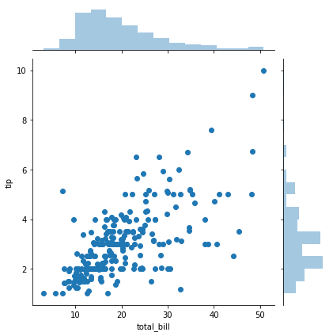


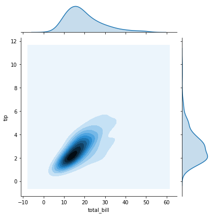


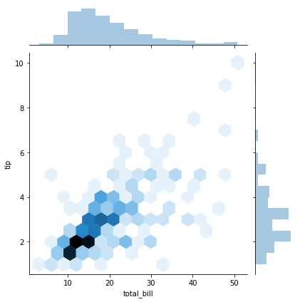


## 10、成对关系

如果要探索数据集中的多个成对双变量的分布，可以直接采用sns.pairplot()函数。它会同时展示出DataFrame中的每对变量的关系，另外在对角线上，你能看到每个变量自身作为单变量的分布情况。它可以说是探索性分析中的常用函数，可以很快帮助我们理解变量之间的关系。

pairplot函数的使用，就像是在DataFrame中使用的describe()函数一样方便,是数据探索中的常用函数。

这里使用Seaborn的自带的鸢尾花iris数据集，这个数据集将鸢尾花分成Setosa、Versicolour和Virginica三个品种，在这个数据集中，针对每一个品种，都有50条数据，每个数据包括4个属性，分别是花萼长度，花萼宽度、花瓣长度和花瓣宽度。这样通过这些数据，就可以来预测鸢尾花卉属于哪一个品种。


```
import matplotlib.pyplot as plt
import seaborn as sns
import pandas as pd
from pandas import DataFrame
# 数据准备
# iris = sns.load_dataset("iris")
iris = DataFrame(pd.read_csv("./seaborn_dataset/iris.csv"))
# 使用Seaborn来画出成对关系
sns.pairplot(iris)
plt.show()
```


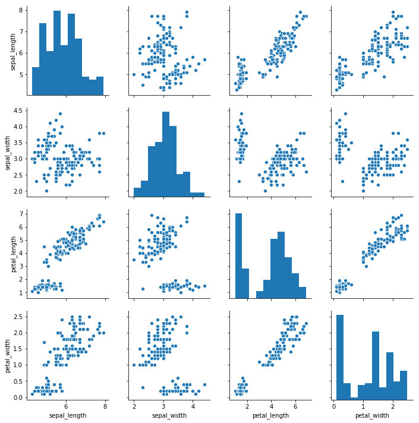


这里使用的Seaborn中的pairplot函数来对数据集中的多个双变量的关系进行探索，从上图可知，一共有sepal_length、sepal_width、petal_length和petal_width这4个变量，他们分别表示花萼长度、花萼宽度、花瓣长度和花瓣宽度。上图相当于4个变量两两之间的关系。比如矩阵中的第一张图代表的是花萼长度自身的分布图，它的右侧的这一张图代表的是花萼长度和花萼宽度的这两个变量之间的关系。

## 总结

1、使用Python的Matplotlib和Seaborn两个可视化工具，需要掌握，两者的关系是：后者是前者的升级版本，相当于Numpy和Pandas的关系

2、视图的分类
    - 参照变量之间的关系对他们进行分类，关系为:比较、联系、构成和分布
    - 按照随机变量的个数来对他们进行划分，单变量分析和多变量分析
    - 数据探索中，成对关系pairplot()的使用，就好像是Pandas中的describe()函数的使用一样方便，常常用于项目的初期可视化探索

3、掌握的知识点：
    - 1、视图的分类，以及可以从哪些维度对他们进行分类；
    - 2、十种常见视图的概念，以及如何在Python中进行使用，都需要使用到哪些函数；
    - 3、掌握代码的编写，信手拈来，体验Python的数据可视化过程。
    

    

## 练习


```
import numpy as np
import pandas as pd
from pandas import DataFrame
import matplotlib.pyplot as plt
import seaborn as sns

# 数据准备
cars = DataFrame(pd.read_csv("./seaborn_dataset/car_crashes.csv"))
sns.pairplot(cars)
plt.show()
```


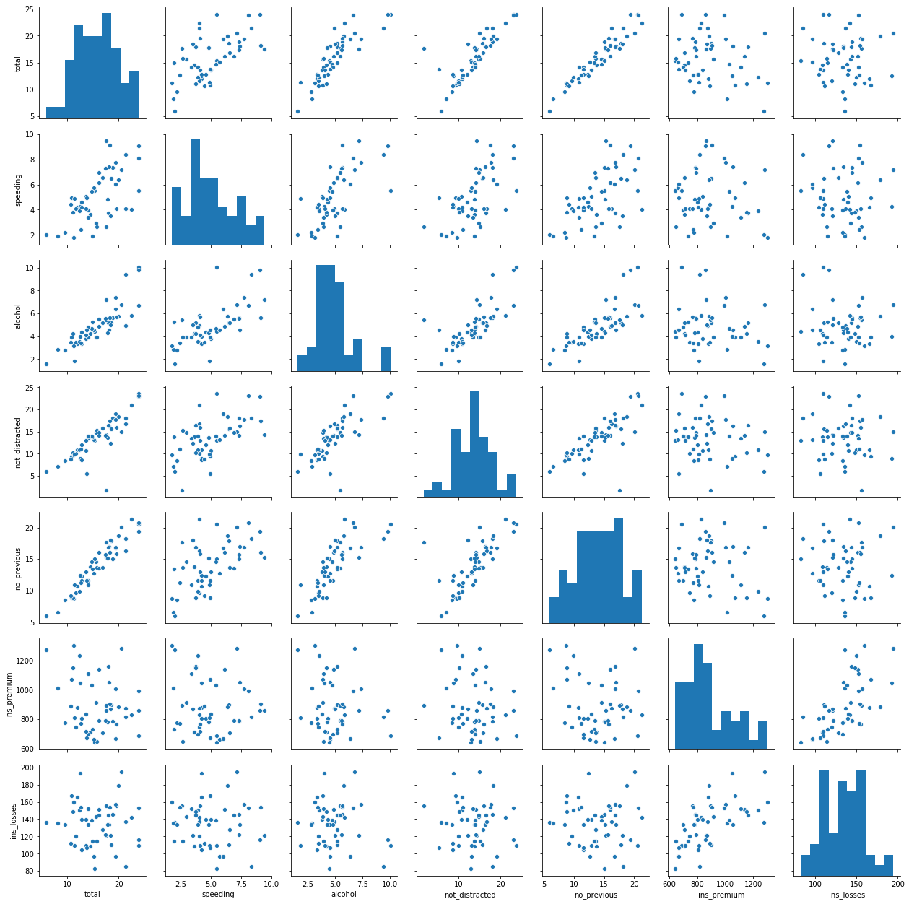


```
import numpy as np
import pandas as pd
from pandas import DataFrame
import matplotlib.pyplot as plt
import seaborn as sns

cars = DataFrame(pd.read_csv("./seaborn_dataset/car_crashes.csv"))
print(cars.head(10))
# 使用seaborn 画出二元变量的分布图（散点图、核密度图、Hexbin图）
sns.jointplot(x="alcohol",y="total",data=cars,kind="scatter")
sns.jointplot(x="alcohol",y="total",data=cars,kind="kde")
sns.jointplot(x="alcohol",y="total",data=cars,kind="hex")
plt.show()
```

       total  speeding  alcohol  not_distracted  no_previous  ins_premium  \
    0   18.8     7.332    5.640          18.048       15.040       784.55   
    1   18.1     7.421    4.525          16.290       17.014      1053.48   
    2   18.6     6.510    5.208          15.624       17.856       899.47   
    3   22.4     4.032    5.824          21.056       21.280       827.34   
    4   12.0     4.200    3.360          10.920       10.680       878.41   
    5   13.6     5.032    3.808          10.744       12.920       835.50   
    6   10.8     4.968    3.888           9.396        8.856      1068.73   
    7   16.2     6.156    4.860          14.094       16.038      1137.87   
    8    5.9     2.006    1.593           5.900        5.900      1273.89   
    9   17.9     3.759    5.191          16.468       16.826      1160.13   
    
       ins_losses abbrev  
    0      145.08     AL  
    1      133.93     AK  
    2      110.35     AZ  
    3      142.39     AR  
    4      165.63     CA  
    5      139.91     CO  
    6      167.02     CT  
    7      151.48     DE  
    8      136.05     DC  
    9      144.18     FL  


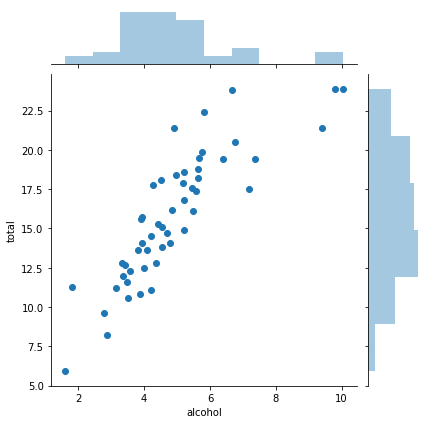


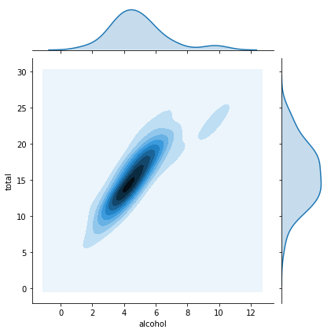


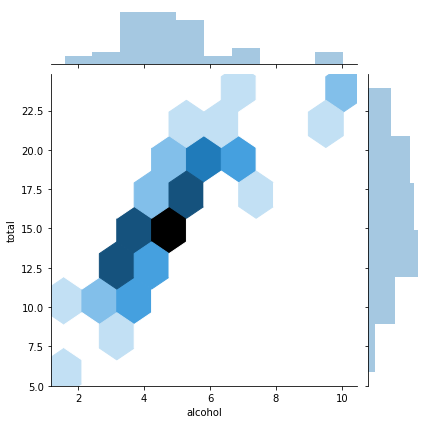


从上面的二元关系可以知道，喝的酒精越多就越容易发生车祸。
