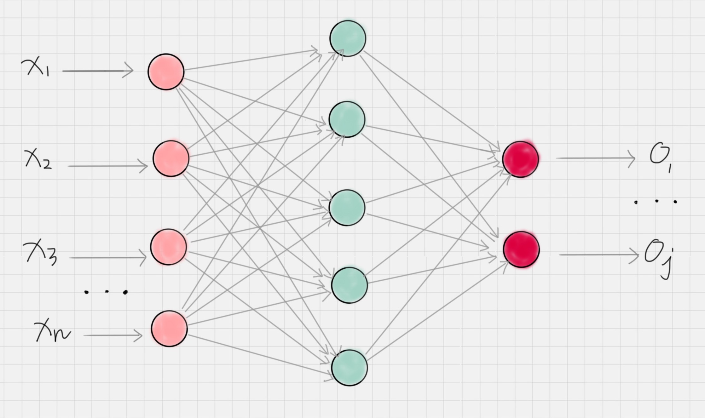
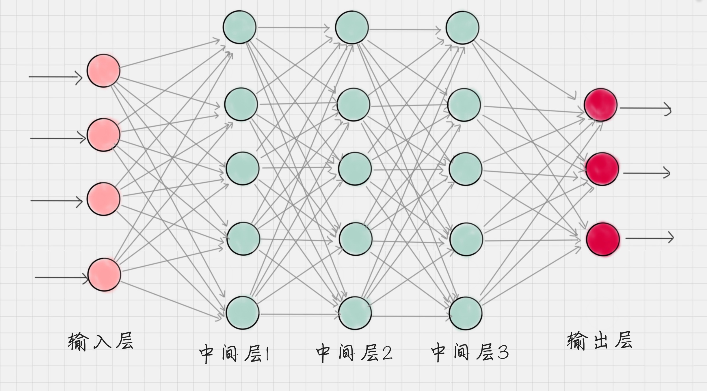

# 42、当我们谈到深度学习的时候，我们都在谈论什么？
在算法的学习过程中，我们学习了数据挖掘的十大经典算法，在实战中也了解了随机森林、逻辑回归的概念以及工具的使用。这些算法都是属于传统的机器学习的算法。那么机器学习和深度学习有什么联系呢？

这里，我们会通过以下几个方面来学习和了解深度学习：

1、数据挖掘、机器学习和深度学习的区别是什么？这些概念都代表什么呢？

2、我们通过深度学习让机器具备人的能力，甚至某些技能的水平超过了人类，比如图像识别、下棋对弈等。那么深度学习的大脑是如何工作的呢？

3、深度网络是基于神经网络构建的，都有哪些常用的网络模型？

4、深度学习有三个重要的应用领域，这三个应用领域分别是什么？
## 数据挖掘，机器学习，深度学习的区别是什么？
实际上数据挖掘和机器学习在很大程度上是重叠的。一些常用的算法，比如K-Means、KNN、SVM、决策树和朴素贝叶斯等。既可以说是数据挖掘算法，又可以说是机器学习算法。那么数据挖掘和机器学习之间是有什么区别？

数据挖掘通常上是从现有的数据中提取出规律模式（pattern）以及使用算法模型（model）。核心的目的是找到这些数据变量之间的关系，因此我们也会通过数据的可视化对变量之间的关系进行呈现，用算法模型挖掘变量之间的关联关系。通常情况下，我们只能判断出来变量A和变量B之间的关系的，但是并不一定清楚这两者之间的有什么具体的关系。在我们谈论数据挖掘的时候，更加强调的是从数据中挖掘出价值。

机器学习是人工智能的一部分，它是指通过训练数据和算法模型让机器具有一定的智能。一般是通过已有的数据来学习知识，并通过各种的算法模型形成一定的数据处理能力，比如分类、聚类、预测、推荐能力等。这样当有新的数据过来的时候，就可以通过训练好的模型对这些数据进行预测，也就是通过机器的智能帮我们完成某些特定的任务。

深度学习是属于机器学习的一种，它的目标是让机器具有智能，只是与传统的机器学习算法不同，它是通过神经网络来实现的。神经网络就好像是机器的大脑，刚开始就像是一个婴儿一样，是一张白纸。但是通过多次训练之后，“大脑”就可以逐渐具备某种能力。这个训练的过程中，我们只需要告诉这个大脑输入的数据是什么，以及对应的输出结果是什么即可。通过多次训练，“大脑”中的多层神经网络的参数就可以自动优化，从而得到一个适用于训练数据的模型。

所以你能看到在传统的机器学习模型中，我们都会讲解模型模型算法原理，比如K-Means的算法原理，KNN的原理等等。而到了神经网络，我们更加关心的是网络的结构，以及网络结构中每层神经元的传输机制。我们不需要告诉机器具体的特征规律是什么，只需要把我们想要训练的数据和对应的结果告诉机器大脑即可。**深度学习会自己找到数据的特征规律！而传统的机器学习往往需要专家（我们）来告诉机器应该采用什么样的模型算法，这就是深度学习与传统的机器学习最大的区别**。

另外深度学习的神经网络结构通常会比较深，一般都是5层以上，甚至也有101层或者更多的层数。这些深度的神经网络可以让机器更加好的自动补获数据的特征。

## 神经网络是如何工作的？
神经网络可以是机器的大脑，经典的神经网络可以使用下面的图来表示：

这里有一些概念需要了解：

**结点：** 神经网络是有神经元组成的，也叫做结点，他们分布在神经网络的各个层中，这些层包括输入层，输出层，和隐藏层。

**输入层：** 负责接收信号，并发送到隐藏层，一般我们将数据传给输入层。

**输出层：** 负责输出计算结果，一般来说输出层结点数等于我们需要分类的个数。

**隐藏层：** 除了输入层和输出层外的神经网络都属于隐藏层，隐藏层可以是一层也可以是多层，每个隐藏等都会把前一层的节点传输出来的数据进行计算（你可以理解是某种抽象表示），这个相当于把数据抽象到另一个维度的空间中，可以更好的提取和计算数据的特征。

**工作原理：** 神经网络就好像是一个黑盒子，我们只需要告诉这个黑盒子输入数据和输出数据，神经网络就可以自我训练。一旦训练好了之后，就可以想黑盒子一样使用，当你传入一个新的数据的时候，他就会告诉你对应的输出结果。在训练过程中，神经网络主要的是通过前向传播和反向传播机制运作的。

什么是前向传播和反向传播呢？

**前向传播：** 数据从输入层传递到输出层的过程叫做前向传播。这个过程的计算结果通常会是通过上一层的神经元的输出经过矩阵运算和激活函数得到的。这样就完成可每层之间的神经元数据的传播。

**反向传播：** 当前向传播作用到输出层得到分类结果之后，我们需要与实际值进行对比，从而得到误差。反向传播也叫做误差反向传播，核心的原理是通过代价函数对网络中的参数进行修正，这样更容易让网络参数收敛。

所以，整个神经网络训练的过程就是不断的通过 前向-反向传播迭代完成的，当达到指定的迭代次数或者达到收敛标准的时候即可停止训练。然后我们就可以拿训练好的网络模型对新的数据进行预测。

当然，深度神经网络是基于神经网络发展起来的，它的原理是与神经网络的一样的。只不过强调的是模型的结构的深度，通常在5层以上，这样模型的学习能力会更加强大。

## 常用的神经网络都有哪些？
按照中间层功能的不同，神经网络可以分为三种网络结构，分别为FNN、CNN和RNN。

**FNN：(Fully-connected Neural Network)** 指的是全连接神经网络，全连接的意思就是每一层的神经元与上一层的所有神经元都是连接的。不过在实际的应用中全连接的参数会过多，导致就算量过大。因此在实际的使用中全连接的神经网络层数一般比较少。 

**CNN:** 叫做卷积神经网络，在图像处理中有广泛的应用，了解图像识别的人对这个词一定不陌生。CNN网络中，包括了卷积层，池化层和全连接层。那么这三个层都有什么作用呢？

**卷积层：** 相当于一个滤镜的作用，它可以把图像进行分块，对每一块推向进行变换操作。

**池化层：** 相当于对神经元的数据进行降维处理，这样输出的维度数就会减少很多，从而降低整体的计算量。

**全连接层：** 通常是输出层的上一层，它将上一层神经元输出的数据转变成为一维的变量。

**RNN：** 称为循环神经网络，它的特点是神经元的输出可以是在下一个时刻作用到自身，这样RNN就可以看做是在时间上传递的神经网络。它可以应用在语音识别、自然语言处理等与上下文相关的场景。

深度学习网络往往包括了三种网络的变种形成，常用的深度神经网络包括AlexNet，VGG19，GoogleNet，ResNet等，这些网络的特点如下：

|模型|AlexNet|VGG19|GoogleNet|ResNet-152|
|--|--|--|--|--|
|时间|2012|2014|2014|2015|
|层数|8|19|22|152|
|卷积层数|5|16|21|151|
|全连接层数|3|3|1|1|
|Top-5错误率|16.4%|7.3%|6.7%|3.57%|

我们能够看出随着时间的推进，提出的深度学习网络层数越来越深,Top-5错误率会越来越低。

你可能会什么是Top-5错误率，实际上这些网络结构的提出和一个比赛有关，这个比赛叫做ILSVRC，英文全称是Large Scale Visual Recognition Challenge。它是一个关于大规模图像可视化识别的比赛，所用到的数据集就是著名的ImageNet数据集，一共包含了1400万张图片，涵盖2万多个类别。

表中的AlexNet就是2012年的ILSVRC冠军，当时的Top-5正确率为84.7%,VGG和GoogleNet是2014年的ILSVRC比赛的模型，其中GoogleNet是当时的比赛冠军，而VGG是当时比赛的亚军，它的效率低于GoogleNet。VGG有两个版本，VGG16和VGG19，分别是16层和19层的VGG网络，这两者没有本质的区别，只是网络深度不同。到了2015年，比赛冠军是ResNet，Top-5的正确率达到了96.43%。ResNet也有不同的版本，比如ResNet50、ResNet101和ResNet152等，名称之后的数字代表的是不同的网络深度。之后ResNet在其他的图像比赛中也多次拿到冠军。

## 深度学习的应用领域
从ImageNet跑出来的这些优秀的模型都是基于CNN卷积神经网络的。实际上深度学习有三大引用领域，图像识别就是其中之一，其他的领域分别为语音识别和自然语言处理。

这三个应用领域都有一个共同的特性，就是都来自信号的处理。我们人类平时会处理图像信息，语音信息以及语言文字信息。机器可以帮助我们完成这三个应用里的某些工作，比如图像识别领域中图像分类和物体检测就是两个核心的任务。我们可以让机器判断图像中都有哪些物体，类别是什么，以及这些物体所处的位置。图像识别被广泛应用在安防领域中。因此人脸识别也是图像识别的重要的应用场景。

Siri大家一定不会陌生，此外还有我们使用的智能电视机等都采用了语音识别技术。语音识别技术可以识别人类的语言指令并进行交互。在语音导航中，采用的是语音合成技术，这样就可以让机器模拟人的声音为我们服务，Siri语音助手也采用了语音识别个合成技术。

自然语言的数理的英文缩写为NPL，它被广泛应有到自动问答、智能客服、过滤垃圾邮件和短信等领域中。在电商领域中，我们可以通过NLP自动给商品评论打标签，在用户决策时候提供数据支持。在自动问答中，我们可以输入自己想问的问题，让机器来回答，比如在百度搜索“姚明的老婆”，就会自动显示出“叶莉”。

此外这些技术还可以相互组合为我们提供服务，比如在无人驾驶中就使用了图像识别、语音识别等技术。在超市里，也可以采用集成图像识别、意图识别等技术。

## 总结
1、我们大概了解了一下深度学习。深度学习也是机器学习的一种。我们之前讲解的数据挖掘十大经典算法，还有逻辑回归、随机森林等算法，这些都是传统的机器学习算法。在日常的生活中可以满足大部分的机器学习的任务。但是对于数据量更大，更开放性的问题，我们可以使用深度学习的算法，让机器自己来寻找规律，而不是通过我们制定的算法来找到分类规律。

2、所以深度学习的普适性会更加强一些，但是也并不代表深度学习就优于机器学习。一方面深度学习需要大的数据量，另一方面深度学习的学习时间，和需要的计算资源都要大于传统的机器学习。我们能够看到各种深度学习的训练集一般都是比较大的比如ImageNet就包含了1400万张图片。如果我们没有提供大量的训练数据，训练出来的深度模型识别的效果未必好于传统的机器学习。

3、实际上神经网络最早在1986年提出来了，之后是不温不火，直到ImageNet于2009年提出来，在2010年开始举办每年的ImageNet大规模视觉识别挑战赛（ILSVRC），深度学习才得到迅猛的发展。2016年Google研发的AlphaGo击败了人类冠军李世石，更加让人们看到深度学习的力量。一个好的问题的提出，可以激发无穷的能量，这就是科技进步源泉，也是为什么在科学上，我们会有各种公开的数据集。一个好的数据集就代表了一个好的问题和使用场景。正是这些需求的出现，才能让我们的算法有更好的用武之地，同时也有了各种算法的相互比拼的平台。

4、深度学习
- 数据挖掘，机器学习，深度学习的区别？
    - 数据挖掘：从大数据中挖掘出价值。实际上数据挖掘和机器学习在很大程度上是重叠的，包括一些算法
    - 机器学习：机器学习是人工智能的一部分，它指的是通过训练数据和算法模型让机器具有一定的智能。一般都是通过已有的数据来学习知识，并通过各种算法模型形成一定的处理能力，比如分类，聚类，预测，推荐能力等；
    - 深度学习属于机器学习的一种，它的目标同样是让机器具有智能，只是与传统的机器学习算法不同，它是通过神经网络来进行实现的，神经网络的层数比较深。
- 神经网络是如何工作的
    - 节点：神经网络是有神经元组成的，我们也称之为节点，他们分布在神经网络的各个层中，这些层包含输入层，输出层和隐藏层。
    - 输入层：负责接收信号并分发到隐藏层。一般我们将数据传入到输入层
    - 输出层: 负责输出计算结果，一般来说输出层结点数等于我们想要分类的个数
    - 隐藏层：除了输入层和输出层外的神经网络都属于隐藏层，可以是一层也可以是多层。相当于是把数据抽象到另外一个维度的空间中，对数据的特征进行提取和计算。
    - 工作原理：神经网络就好像是一个黑盒子，我们只需要告诉这个黑盒子我们的输入数据和输出数据，神经网络就可以自我训练
    - 前向传播：数据从输入层传递到输出层的过程。
    - 反向传播：当前向传播作用到输出层得到分类的结果之后，我们需要与实际值进行对比，从而得到误差。通过代价函数对网络中的参数进行修正，更加容易让网络得到收敛。
- 常用的神经网络
    - 三种主要的网络结构
        - FNN：指的是全连接神经网络
        - CNN：叫做卷积神经网络
        - RNN: 称为循环神经网络
    - 深度学习网络结构
        - AlexNet、VGG19、GoogleNet、ResNet
        - 这些模型都是基于ImageNet数据集，来自ILSVRC比赛
        - 随着时间推进，网络结构越来越深，Top-5的准确率越来越高
- 深度学习的应用领域
    - 图像识别
    - 语音识别
    - 自然语言处理NLP
